# MDict词典软件的安装和使用方法

2023/7/18 - april211

## 故事

前段时间我买了牛津高阶词典第十版，准备先仔细地过一遍基础词汇，给雅思考试夯实一下基础。就下面这本。

在翻看词典的时候，突然发现了有**电子版牛津词典**这么个玩意儿。当时觉得有网易有道词典上的牛津释义似乎就够了，似乎不需要再有什么额外的软件支持。但是还是暗中做了个计划，打算过几天后折腾一下……

*就是今天（笑*

## 正篇

### 介绍

今天发现了一个好东西，叫 [MDict - Home](https://www.mdict.cn/wp/?lang=en) 。

这是一个界面简洁的**本地**词典软件。它自身并不携带任何词条和词典数据，仅提供一个查询软件的外壳，而**词典数据需要用户自行在其他地方下载**。

由于我使用的是 Ubuntu 系统，而**官方下载中并不提供 Linux 系统的安装包**（这点需要 diss 一下）。所以我的思路是在名为 [麟卓卓懿](https://www.linzhuotech.com/) 的 Android 兼容环境下**安装该软件的 Android 版本**，其他环境可以自行尝试，应该也不会有什么大问题。 👍

*关于**麟卓卓懿**这个 Android 兼容环境，我计划再另外单出一篇随笔来介绍一下它的安装过程、使用方法和注意事项，这里就直接跳过关于它的安装和配置的过程了。如果你使用其他类似的 Android 环境（或者模拟器），或者是直接使用 Android 手机，那下面的介绍也应当是适用的。*

### Mdict软件下载

这里给出官网的下载页面链接：[MDict - Download](https://www.mdict.cn/wp/?page_id=5325&lang=en) 。

随后，选择下载 apk 格式的安装包，如下图所示。

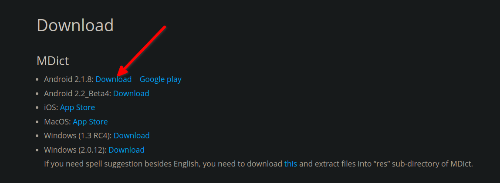

### 词典数据下载

我是从 Google 上搜出来的词典数据…… 这个我也不知道是哪个大佬做的……

放个 [Google 搜索页](https://www.google.com/search?q=%E7%89%9B%E6%B4%A5%E9%AB%98%E9%98%B6%E8%AF%8D%E5%85%B8+%E7%AC%AC%E5%8D%81%E7%89%88+%E7%94%B5%E5%AD%90&oq=%E7%89%9B%E6%B4%A5%E9%AB%98%E9%98%B6%E8%AF%8D%E5%85%B8+%E7%AC%AC%E5%8D%81%E7%89%88+%E7%94%B5%E5%AD%90&aqs=chrome..69i57j33i160l2.16122j1j7&sourceid=chrome&ie=UTF-8) 的链接吧，搜索结果的第一个应该就是了，点进去找一找就找到了……

你下载的应该是一个 tar 包。解压完是这样的：

体积比较大，最大的有 2GB 多。这也是使用本地方式查询词汇的一个特点，你可以说它好也可以说它坏，取决于个人喜好和习惯。

### 软件安装

安装过程很简单，首先打开 麟卓卓懿 的应用界面，你应该能在右上角找到 `本地安装` 的按钮，如下图。

随后在弹出的文件浏览窗口中选择刚才下载的 MDict 词典软件，模拟环境会自动读包并开始安装。

安装成功后，你应当能从应用面板中找到 MDict 软件的图标，如下图。

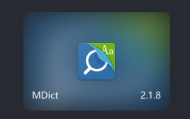

这时先不要点击运行，因为还没有导入词典数据，打开会发现词典列表是空的，而且在软件内并不容易添加词典数据。

### 词典数据的导入

按照 [MDict 官方 FAQ](https://www.mdict.cn/wp/?page_id=5229&lang=zh) 的指引：

> 如何将词典导入设备?
>
> Iphone/Ipad用户可以通过Itunes的文件共享功能将词典文件导入设备，详细步骤可以在应用程序中选择选项->帮助。有详细的截图说明。
>
> Android用户需要将词典文件放在 /mnt/sdcard/mdict/doc目录下，或者通过应用中的设置额外词库目录的选项来指定目录。

这里我们选择将词典数据导入到指定路径 `/mnt/sdcard/mdict/doc` 目录下。

通过在 Android 运行环境中使用文件浏览器的方法在我这里似乎行不通，表现为耗时近乎无限长，文件剪切任务无法在合理的时限内完成。所以这里我使用了一个更为直接的方法。

首先**在 Ubuntu 界面下**，找到虚拟环境的手机数据存储位置。在我这里是 `/home/april211/.zhuoyi/common/data/media/0`，你的也应当是类似的。

> 这个路径的寻找方式也很简单：
> 
> 1. 在 麟卓卓懿 中随意打开一个软件（例如：时钟）
> 2. 找到软件窗口界面右上角标识有三道横线的一个按钮，点击并在弹出菜单中选择 `文件共享`，会弹出系统的文件管理窗口，如下图所示。
>     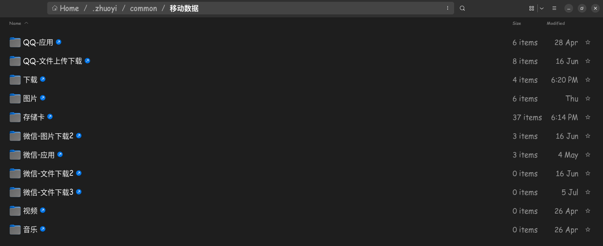
> 3. 随后在该页面右键启动 `Terminal`，并执行 `ls -al` 命令，找到这些软链接所指向的位置，如下图所示。
>     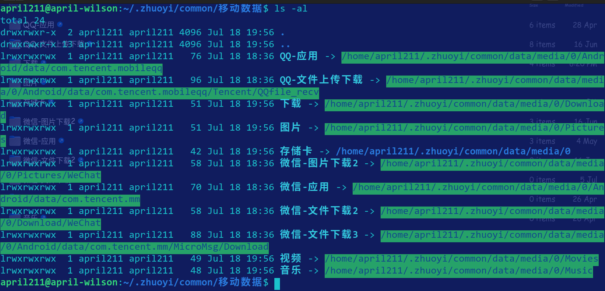
> 4. 然后选择你喜欢的文件操作方式执行下面的文件移动步骤就行了。

你应当能够在这个目录下找到名为 `mdict` 的文件夹。

随后，我们将之前下载并解压出来的 **[5 个词典文件](###词典数据下载)** 移动到 `mdict/doc` 路径下就好了。

这些都完成后，在虚拟环境中打开 MDict 软件，就可以发现词典已经被导入了，如下图。

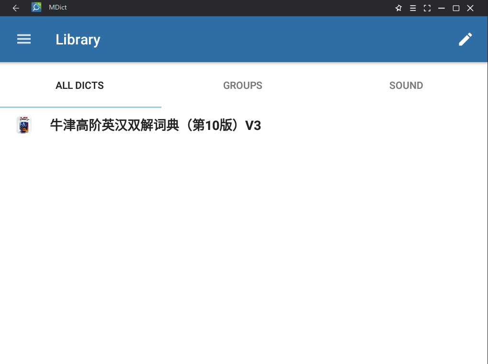

点击即可开始使用～ 😎

### 基本使用流程

看一下日常使用的界面：

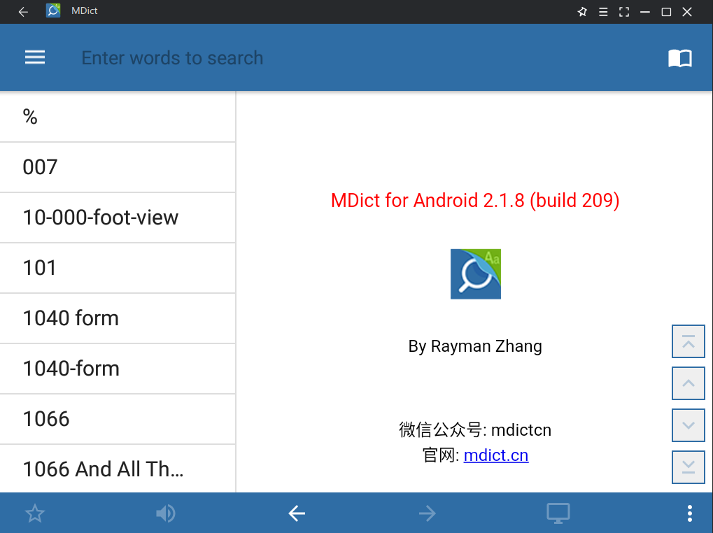

用惯了市面上其他查词软件的同学可能会觉得有点过于简洁？哈哈，这正是这个软件的一大特点。

界面的上方就是**查询栏**了，你可以在这里用键盘输入单词并敲回车，它会为你展示结果：

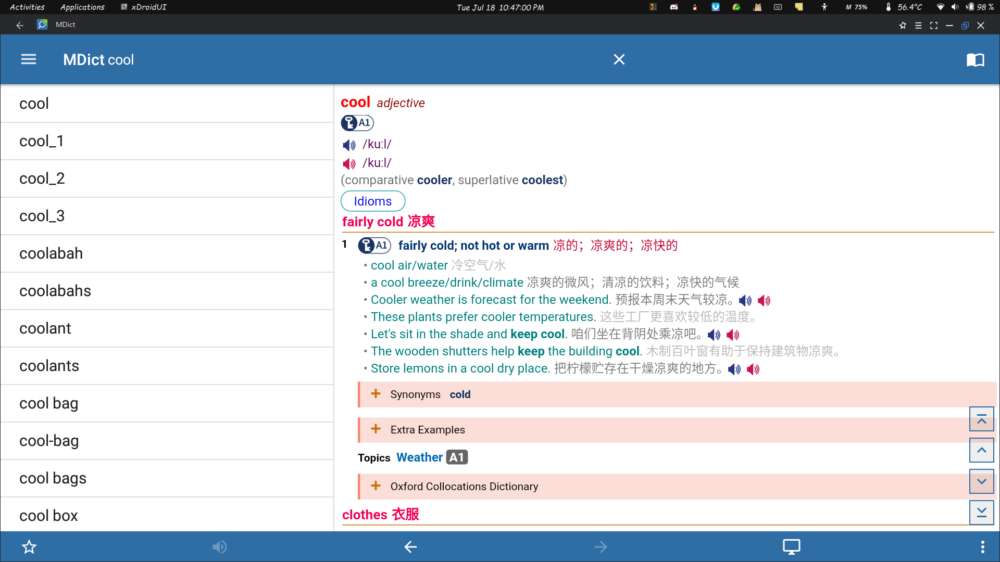

可以发现这里面的界面元素还是比较丰富的，这得益于我们导入的词典文件中包含格式和风格的限定文件。你可以单击发音、展开折叠内容，并使用鼠标滚轮上下流畅地滑动，或者是点击窗口右下方的控制按钮执行页面快进操作…… 是不是感觉和桌面软件没什么区别了，甚至界面还要好看数倍？这就是 麟卓卓懿虚拟环境 的力量……（笑

软件支持**点击界面中的词汇直接弹出查询窗口**：

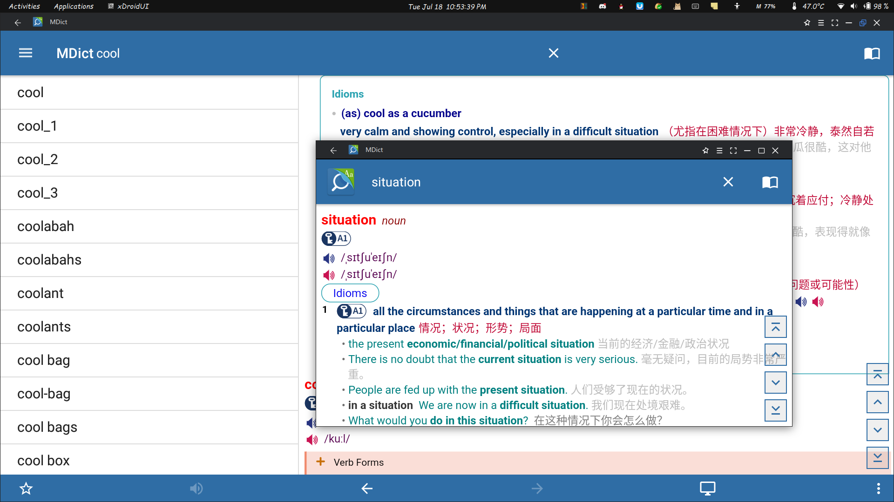

你可以看到左下角有个星标，那是收藏按钮。你可以尝试使用一下，不过我自己暂时只用这个查详细释义，并不在这里抗遗忘。

下方有返回和前进的按钮，这个和浏览器对应的按钮功能类似，可以让你遍历查询的词汇，返回到你想要的位置。

你还可以通过 `History` 页面，回顾你**查词的历史记录**：

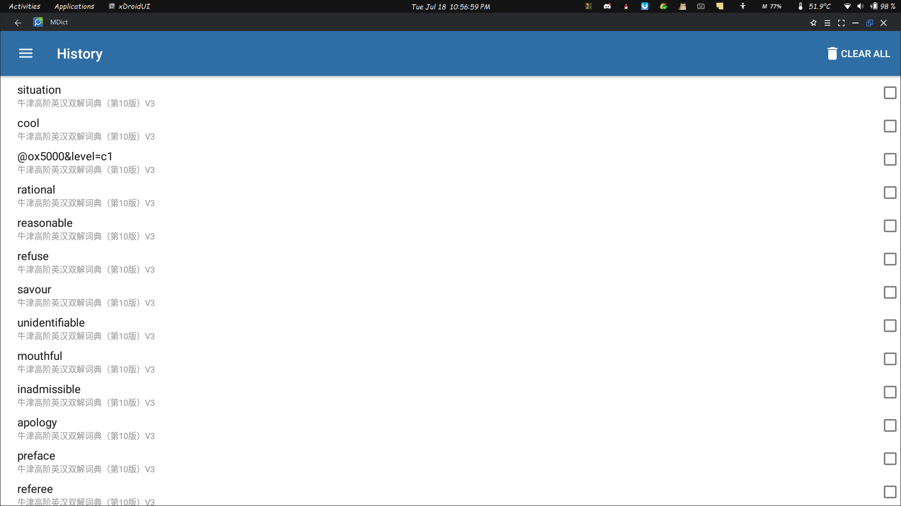

目前主要就是这几种用法。可以说这个软件最大的优点是将数据来源交给其他方面的开发者，这使得我们可以获得一些特殊的优质资源，使用这个软件也是为了使用它所依赖的词典数据。所以我们大可不必在乎界面和功能的简陋，只需要在乎我们拿到的词典数据优不优良就行了。

目前来看，我拿到的这个词典数据似乎比纸质词典的内容要多一些？在某些例句的举例上，电子版似乎更为丰富。例如，对于单词 `individuality`，你在网易有道词典和第十版纸质词典上只能查到 1 条例句：

> She expresses her individuality through her clothes.  
> 她通过穿着表现个性。

但是，在这个电子版词典中，你可以**获得 8 条例句，并且获得词源信息**：

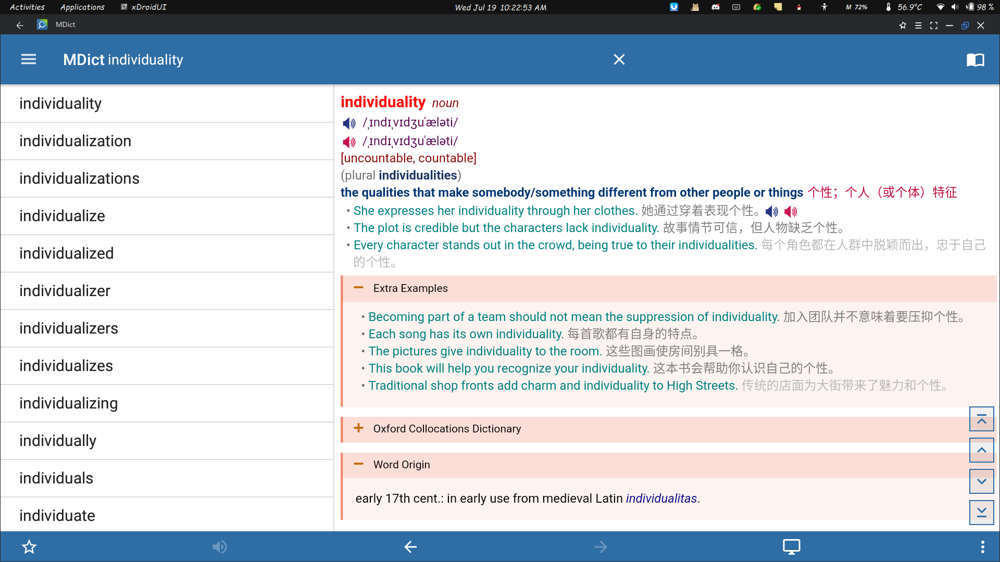

你还可以轻而易举地**复制词条的内容**到剪切板上：

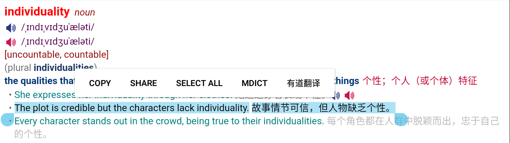

并且，这款软件也支持你**顺序地浏览**这本词典，只需要你从左侧依次选择即可：

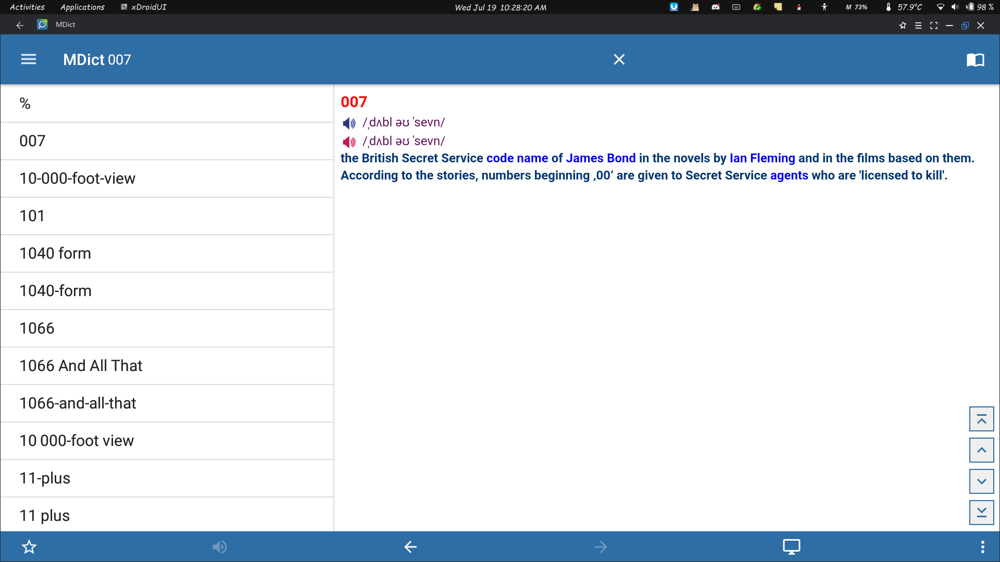

（这搞得我现在都有点后悔买正版纸质书了？🤣 不过纸质书有质量很高的彩页部分，以及前言使用指导部分，~~这些词典软件里都没有，见更新~~。最后再怎么说也不能完全白嫖吧……）

另外，你至少不用在需要快速查词时再去翻那本厚词典了，只要在需要勾画内容时、或者顺序学习词汇时再拿起它来就行了；无论在操作和视觉感受上、还是在词条数据的权威性上，它都要比网易有道词典更胜一筹。

这是个比较冷门的软件，我周围似乎并没有人在用。写这篇随笔除了记录一下流程，也是为了支持一下这款优秀的软件，希望它能继续做下去。

---

**更新**：是我草率了🤣连彩页都有……只不过似乎不是连续的……

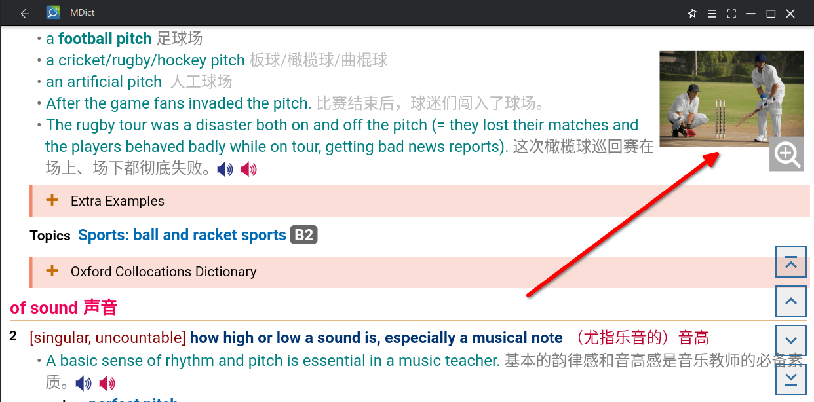

另外这里提供一个 [简书的链接](https://www.jianshu.com/p/e279d4a979fa)，里面有更多本词典的网盘下载链接。下载后，就像上面一样，将词典文件复制到 `doc` 路径下，重启软件就可以用了，查词时软件会帮你**同时在所有词典中进行查询**。

我使用的牛津高阶电子版中的一些附加例句的翻译是不正确的，例如这句：

> He has very lowbrow tastes.
>
> 他的眉毛很低。

使用时注意一下就好了，一般很容易就可以识别出来，瑕不掩瑜。

