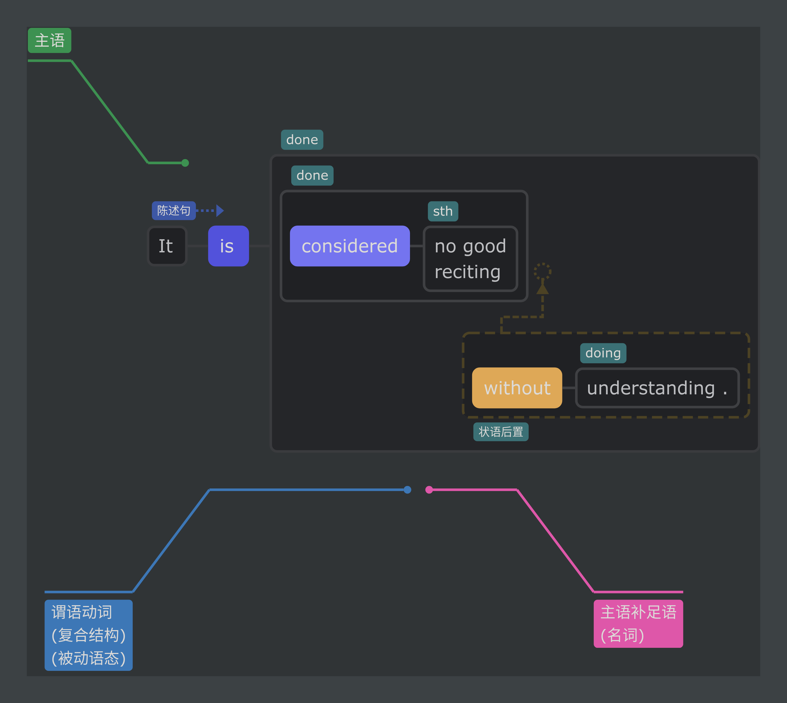
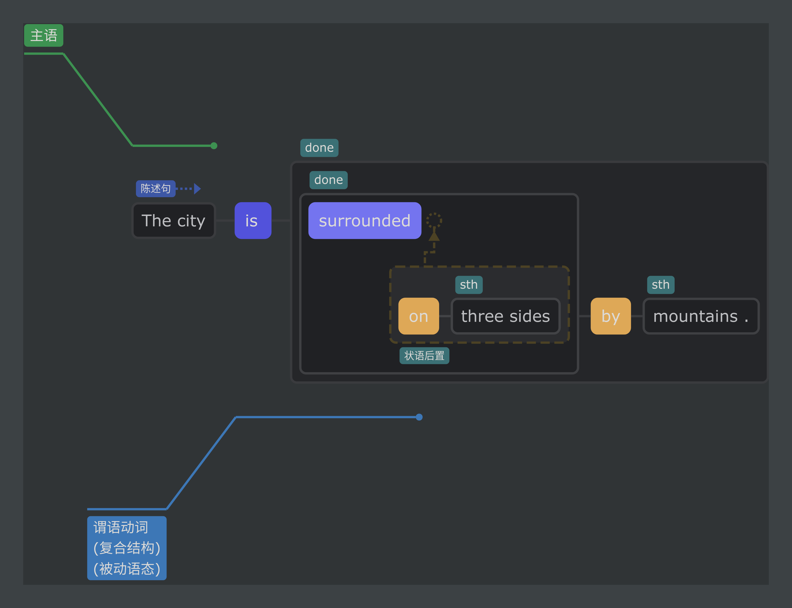
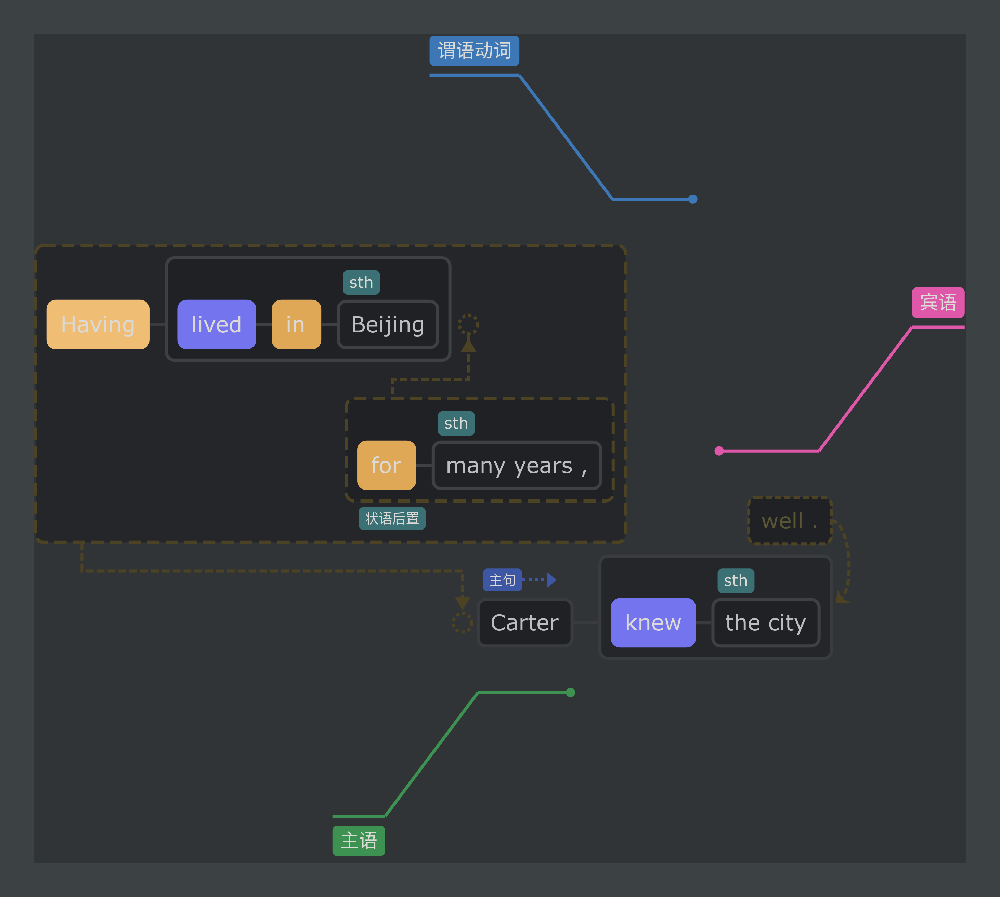
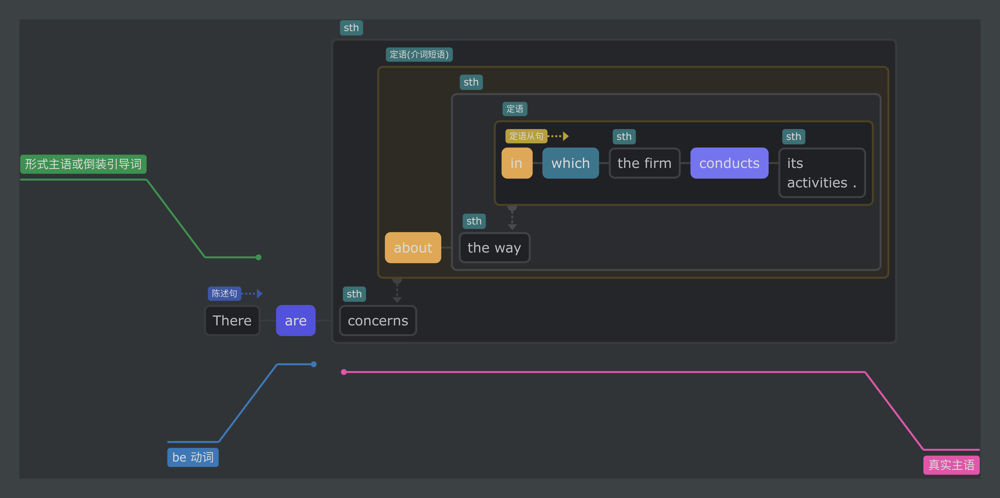
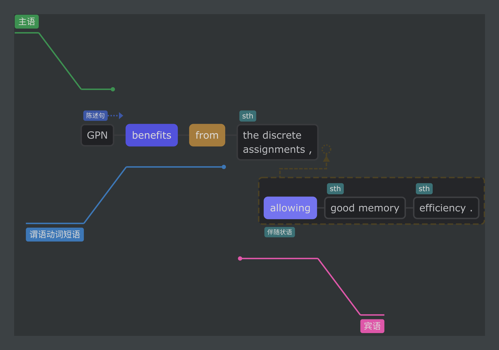
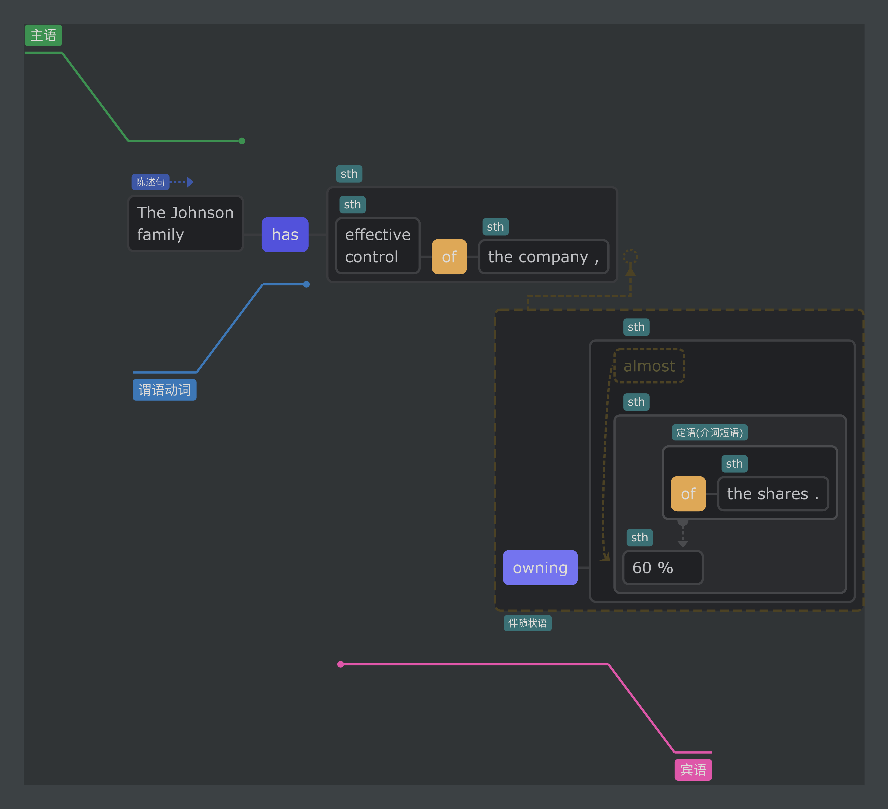

# 句子成分划分案例

这个文件把我在学习语法和句子成分划分时的划分结果进行了存档。

划分的结果截图来源于 [Enpuz](http://enpuz.com/)，这是一款还算不错的在线句子划分小工具。

## 2023-7-31

I invite you for a big dinner. 

It is considered no good reciting without understanding.

## 2023-8-1

The city is surrounded on three sides by mountains.

>【[注意](https://baike.baidu.com/item/%E8%BF%87%E5%8E%BB%E5%88%86%E8%AF%8D/4251946?fromModule=lemma_inlink#9)】过去分词作表语与被动语态的区别：过去分词作表语，主要是表示主语的状态，而被动语态则表示动作。

Having lived in Beijing for many years, Carter knew the city well.

> 动词的分词形式 + (,) + 主句, 构成状语前置结构

## 2024-2-15

There are concerns about the way in which the firm conducts its acitvities.

对于这种定语从句的用法还不明确，主要疑点在于：主句和从句的结构似乎都是完整的，与另外一种常见的、较容易理解的定语从句形式不同。

> There are concerns about the way. 
> 
> The firm conducts its acitvities.

但是这种形式的定语从句很常见，需要再专门学习一下。

## 2024-4-18

GPN benefits from the discrete assignments, allowing good memory efficiency.

这是简化后的句子。原句为：

> **GPN benefits from the discrete assignments** generated by the graph parsing algorithm, **allowing good memory efficiency** while preserving node information intact.

Enpuz的解释：

> 动词(或动词短语) + **现在分词作伴随状语**, 两者同时发生

## 2024-5-25

The play opened last week to universal acclaim. 

汉译：

> 这部戏上周开演，受到了普遍好评。

知识点：状语后置

## 2024-9-28

The Johnson family has effective control of the company, owning almost 60% of the shares.

汉译：

> 约翰逊家族有效地控制着该公司，持有近60%的股份。

知识点：**现在分词作伴随状语**, 两者同时发生

