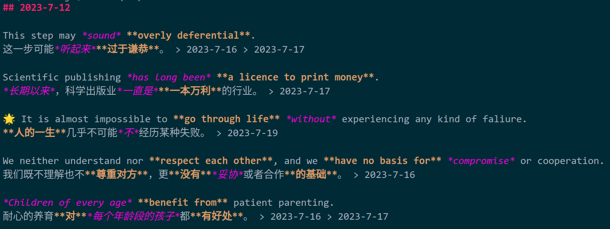

# 收藏的例句

此文件收录我从有道和其他地方获取到的例句，**重点收录包含有 [Pending_Words_Queue](./Pending_Words_Queue.md) 中所含单词的例句**。

我自己对**有代表性的例句**的判断标准是：

- 适用范围广，可推广性强，可改造性好
- 同时包含所谓的高阶词汇和中低阶词汇
- 包含优秀的句法和语法
- 表达意境优美、独特
- 不长不短

具有这几种特征的例句有**把不同的词汇联系到一起**的作用，并且很多例句**可以直接在学习生活中使用**。所以精学例句应当是一种高效的学习方法，这无论是对下一阶段的段落乃至文章构思和撰写、还是对口语的习得，都应当有很好的帮助。

另外，针对于描述情景、画面的例句需要更重视一点，因为这类例句在生活中显得更常见一些，毕竟视觉信息、感官信息是我们接触甚为频繁的信息类型，我们可以随时尝试加以利用。

**重难句**在句首使用 🌟 标记；每次**复习**的完成程度在 50% 以上才会使用日期进行标记。

个人建议**使用 VSCode 直接观看本文档的 Markdown 原始文本**，效果如下图。另外还可以使用 `Ctrl + F` 快速搜索例句。

## 2023-7-12

This step may *sound* **overly deferential**.

这一步可能*听起来***过于谦恭**。 > 2023-7-16 > 2023-7-17

Scientific publishing *has long been* **a licence to print money**.

*长期以来*，科学出版业*一直是***一本万利**的行业。 > 2023-7-17

🌟 It is almost impossible to **go through life** *without* experiencing any kind of faliure.

**人的一生**几乎不可能*不*经历某种失败。 > 2023-7-19

We neither understand nor **respect each other**, and we **have no basis for** *compromise* or cooperation.

我们既不理解也不**尊重对方**，更**没有***妥协*或者合作**的基础**。 > 2023-7-16

*Children of every age* **benefit from** patient parenting.

耐心的养育**对***每个年龄段的孩子*都**有好处**。 > 2023-7-16 > 2023-7-17

## 2023-7-16

He is good at **looking after** his own *interests*.

他善于**照顾**自己的*利益*。 > 2023-7-17

She has **business interests** in France.

她在法国拥有**商业利益**。 > 2023-7-17

The **deathly pallor** of her skin *had been replaced by* the faintest flush of colour.

她皮肤**死一般的苍白**已经*被*极其微弱的一点颜色*所取代*。 > 2023-7-17

She **turned a deathly shade of white** when she *heard* the news.

她*听*到这个消息时**面如死灰**。 > 2023-7-17

🌟 The public prosecutor is **seeking legal advice on** *whether* the book may **be defamatory**.

~~检察机关正在**搜集相关的法律证据**，要指控此书*是否*已经**涉嫌诽谤**。~~
公诉人正在*就*这本书*是否*具有诽谤性**寻求法律意见**。 > 2023-7-17

The President **detoured to** Chicago for *a special meeting*.

总统**绕道到**芝加哥参加*一个特别会议*。 > 2023-7-17

🌟 **Special provision** *should be made* for children.

*应该给*孩子们**特别的供给**。 > 2023-7-17

When you *come down to* it, however, the basic problems of life **have not changed**.

然而，*归结*起来，生活的基本问题**并未改变**。 > 2023-7-17

🌟 Large numbers of soldiers **deserted** *as* defeat **became inevitable**.

*当*战败**已成定局**，许多士兵**开小差跑了**。 > 2023-7-19

The house **seemed muted** *as if* it **had been deserted**.

这栋房子**悄无声息**，*好像*一直**没有人居住**。 > 2023-7-17

*As usual at that hour*, **the place was deserted**.

*跟平常那个时刻一样*，**那个地方空荡荡的**。 > 2023-7-17

**A deathly silence** *hung over* the square.

**死一般的静寂***笼罩*着广场。 > 2023-7-17

This is **pure slander** and I'll *sue* him *for* **defamation** if he doesn't apologize.

这**纯属污蔑**，如果他不向我道歉，我将*控告*他**诽谤**。 > 2023-7-17

She was an elegant and **accomplished woman**.

她是一位优雅的**才女**。 > 2023-7-19

She is one of **the most accomplished** players *in history*.

她是*历史上***最优秀的**运动员之一。 > 2023-7-17

This *proposal* will **incense** conservation *campaigners*.

这项*提议*将**激怒**自然保护的*推动者*。 > 2023-7-17

Any **outside criticism** is *routinely* **dismissed as interference**.

任何**外来批评**都*照例*被**当作干涉而不予理睬**。 > 2023-7-17

They *resent* foreign interference in the **internal affairs of their country**.

他们*憎恶*对他们**国家内政**的外来干涉。 > 2023-7-17

🌟 Rapid urbanization *brings with it* a more **westernized** and *generally* more sugary **diet**.

迅速的城市化*带来了*一种更为**西方化的**、*普遍*摄入更多糖分的**日常饮食**。 > 2023-7-17

These **structures** *are responsible for* **mediating** gender divisions.

这些**组织机构***负责***调停**性别分歧。 > 2023-7-17

🌟 *Educational success* **is mediated by** economic factors.

经济因素**影响着***教育的成功*。 > 2023-7-17

## 2023-7-18

🌟 He *prefaced* the diaries *with* **a short account of** how they were discovered.

他在*前言*中**简要叙述**了发现日记的经过。

🌟 Many of the bodies were **unidentifiable** *except* by **dental records**.

许多尸体*若不是*靠**牙科病历**就**无法辨认**。 > 2023-7-19

His recent comments *savour of* **hypocrisy**.

他最近那番评论显得*有点***虚伪**。

He sat **for a few moments**, *savouring* the memory *to the full*.

他坐了**一会儿**，*尽享*记忆。 > 2023-7-19

## 2023-7-19

🌟 Becoming part of a team *should not mean* **the suppression of individuality**.

加入团队*并不意味着*要**压抑个性**。

The college *is dedicated to promoting* **lifelong learning**.

该学院*致力于推进***终身学习**。

🌟 Is the government going to *honour its commitments on* the **reduction** of air pollution?
政府会*兑现*其**减少**空气污染的*承诺*吗？

🌟 The course **is designed to** *equip* students *for* a career in nursing.

此课程**旨在**使学生*能够胜任*护理工作。

Here he **received the education** that would *equip* him *to* **take his place in society**.

他在这儿**所受的教育***能*让他**在社会中自立**。

*Publication dates are given* **in brackets** after each title.

*出版日期***括于**书名后面。

He **evinced** a strong desire to *be reconciled with* his family.

他**表现出***与*家人*和好*的强烈愿望。

The waiters *came* hurrying *forward* with **obsequious smiles** on their faces.

服务员脸上含着**不愉快的笑容**，匆匆*向前*。

Don't **be fooled into** thinking they're going to *change anything*.

别**上当受骗**，以为他们打算*作出任何改变*。

🌟 Her parents were never **pushy** *although* they encouraged her **acting ambitions** *from an early age*.

*虽然*她的父母*从小*就鼓励她**表现出雄心壮志**，但他们从不**急躁**。

The company *has seen* **record sales** *over the past year*.

该公司*在过去的一年*中*创下了***创纪录的销售额**。

The election commission *found that* **neither** candidate received enough votes to avoid a **run-off**.

选举委员会*发现*，两个候选人**都没有**获得足够的选票来避免**决选**。

*Without wanting to criticize*, I think you **could have done better**.
 (= used before you make a critical comment)
*我不是想要批评谁*，只是认为你**本可以做得更好一些**。

The party *was organized* **without her knowing anything** about it.
 (without sb.
 doing sth.
)
聚会*已操办妥当*，**她却一无所知**。

## 2023-7-20

He *was furious with* himself for **letting things get so out of control**.

他*对*自己*很恼火*，怪自己竟**让事情变得如此不可收拾**。

She was **still** furious **over** *suggestions* that she had *lied to the public*.

她**对**那些*暗示*她*欺骗公众*的话**仍然**怒不可遏。

The president *is said to* **be furious at** the newspaper report.

*据说*总统**对**报纸的报道**大动肝火**。

🌟 **A furious row** *broke out* last night *after* **it was revealed that** hundreds of prisoners had been **released** early from jail.

昨晚**有消息显示**，数百名囚犯已从监狱中**获释**，*随后*这*引起了***愤怒的争吵**。

cThe **exhibition** *reflects* the **cultural diversity** of modern British society.

**展览***反映了*现代英国社会的**文化多样性**。

Our proposal *tries to accommodate* the special needs of **minority groups**.

我们的提案*尽量照顾*到**少数群体**的特殊需要。

I needed to **accommodate to** the new *schedule*.

我需要**适应**新的*时间表*。

*Even* these improvements *to* the service **failed to silence** a grumbling chorus of complaints.

*即使*对服务作了这些改进*也***不能平息**一片抱怨声。

Police are *investigating* the **disappearance** of a young woman.

警方正在*调查*一名年轻女子的**失踪**案。

🌟 Most drugs *offer* **either** no real improvement **or**, *at best*, only **moderate** improvements.

大多数药**或者**没*有*真正疗效，**或者***最多也就是（充其量）***稍有**疗效。

🌟 **One** *cannot fail to* be struck by **the singularity of** his sculptures.

**一个人***一定会*对他的雕塑**的奇异之处**感到震惊。

🌟 The **latest** government **initiative** *aims to* reduce **rural unemployment and deprivation**.

政府的**最新举措***旨在*减少**农村的失业和贫困**。

The **bonus** helped *maintain morale* among the staff.

发放**奖金**有助于*保持*员工的工作*热情*。

*Don’t you just* **adore** that dress!
那件连衣裙*简直*让人**喜欢得要命**！

*There needs to be* a partnership between police and public **in the fight against crime**.

**在打击犯罪方面**，警察和公众之间*需要建立*伙伴关系。

**A mere** 2 per cent of their *budget* has been *spent on publicity*.

他们的*预算*中**只有**2％*用于宣传*。

**The mere fact that** they were *prepared to talk* **was encouraging**.

他们*愿意商谈*，**这就很不错了**。（只凭…就足以）

He *is in the enviable position of* having two job offers **to choose from**.

他有两份工作**可选**，真*让人羡慕*。

🌟 Talks are **taking place** *in an attempt to* **avert a strike**.

**正在进行**谈判以*尝试***避免出现罢工**的局面。

The document provided **a revealing insight** into the government's *priorities*.

这份文件使人**看出**政府的*轻重缓急*是怎样安排的。

The writing is **workmanlike**, *if* sometimes **too casual**.

文笔**娴熟**，*虽然*有时**过于随意**。

## 2023-7-21

Salary *is a function of* age and **experience**.

工资*视乎*年龄和**经验***而定*。

The **procession** made its *stately* progress through the streets of the city.

**游行队伍***缓慢而庄严地*穿过城市的街道。

*There is* **acknowledgement on his part** that he *was to blame*.

**他承认**他*应该受到谴责*。

*Growing levels of* pollution **represent** a serious *health hazard* to the local population.

*日益严重*的污染**对**当地人民的*健康*构成了重大*威胁*。

**Careless drivers** *hazard* other people's lives **as well as** their own.

**粗心大意的驾驶者***拿*他人**和**自己的生命*冒险*。

## 2023-7-22

🌟 *Safety measures* were **carried out** *in compliance with* paragraph 6 of the building **regulations**.

*遵照*建筑**规程**的第 6 条**实施**了*安全措施*。

His work *suffered* because of his **total absorption in** sport.

他**痴迷于**体育运动而*影响*了工作。

🌟 Their **harmonious relationship** resulted *in part from* their **similar goals**.

他们**融洽的关系***部分来自于*他们**相似的目标**。

It is selling **very well**, *in part because* the **packaging** is so attractive.

它卖得**非常好**，*部分原因在于***包装**很吸引人。

She had started to *delve into* her father's **distant past**.

她开始*探究*她父亲**久已逝去的岁月**。

Police are *urging* **anyone who** saw the accident to *contact* them immediately.

警方*敦促*事故的目击**者**立即与警方*联系*。

If he can't *get* his talk *sorted out*, we'll **have to** ask someone else.

如果他不能*把*自己的讲话*整理（安排）好*，我们**就得**另请他人。

It was difficult to **sort out** the lies **from** the truth.

谎言和真话难以**辨别**。

The *inquest* was **adjourned** *pending* further investigations.

*审理***暂缓**，*等候*进一步调查。

That day still *stands out as the greatest* day in my life.

那天仍是我一生中*最*美好的日子。

🌟 *Owing to* circumstances **beyond our control**, the flight *to* Rome **has been cancelled**.

*由于*出现了**我们无法控制的**情况，飞*往*罗马的航班**已被取消**。

She *struggled to* **keep control of** her voice.

她*竭力***控制住**自己的声音。

She *bowed to the inevitable* (= accepted a situation in which she had no choice) and **resigned**.

她*迫于无奈*，只得**辞职**。

**In effect**, we’ll be *earning less* than we were last year.

**实际上**，我们*挣钱*会比去年*少*。

She sat **with** her *hands in her lap*.

她双*手放在大腿上*坐着。

🌟 They were *not* able to start the meeting *until* the **requisite number of members were present**.

*直到*出席的成员**达到规定的人数**，他们*才*能开始会议。

He *sniffed at* my choice of restaurants and suggested his own favorite.

他*对*我挑选的餐馆*不以为然*，提出去他喜欢的那家。

He **was invited to** *give a poetry reading* as part of the literary festival.

他**应邀**在文学节上*表演诗朗诵*。

## 2023-7-23

She **experienced a confusing mixture of emotions**.

她**百感交集**。

🌟 The discussion was about *whether* the child was old *enough to* **make an informed decision**.

讨论的对象是孩子是否*大到可以***做出明智的决定**。

🌟 **Prejudices** can easily *become implanted in the mind*.

**偏见**容易*在头脑中扎根*。

They *went through agony* in the search for their **missing relatives**.

他们在寻找**失散亲人**的过程中*经历了极大的痛苦*。

His reputation is **without a blemish**.

他的名誉可说是**白璧无瑕**。

We're *seeking for* **alternative materials** which might *bring the cost down*.

我们*正在寻找*一种可以*降低成本*的**替代材料**。

🌟 Diane had *dedicated* her life *to* caring for him **to the exclusion of** all else.

黛安娜曾**抛开**其他一切，来*一心一意地*照顾他。

He **chose to** *reciprocate* the gift *with* a sample of his own art.

他**选择**以自己的艺术品作为对这个礼物的*回应*。

Her *passion for* him **was not reciprocated**.

她*对*他*的热情***没有得到回应**。

He's that **rare breed** of politician who has *remained true to his ideals*.

他是那种*一直忠于自己理想*的**稀有**政客。

During the interview, she *fumbled* helplessly *for* words.

面试时她支支吾吾*找不出*适当的话语。

## 2023-7-24

The British government **ended up underwriting** the entire project.

**结果**整个项目的费用都由英国政府**承担**。

They *interceded with* the authorities *on behalf of* the **detainees**.

他们*为***被拘留者**向当局*求情*。

These examples **are directly pertinent to** the question asked.

这些例子与提出的问题**直接相关**。

Most of them *led lives of* selfless moral **rectitude**.

他们大多数人*过着*无私的道德**正直***的生活*。

He **cherishes the hope that** one day they will meet again.

他**希望**他们有一天能再次见面。

🌟 She *gives the impression of* being **rather** conventional, but *under the surface* she is **wildly** eccentric.

她*给人印象***很**传统，*实际上*却是个**极**不寻常的人。

It *seems* like a good idea *on the surface* but there **are sure to** be problems.

这主意*乍一看*不错，但**肯定**存在问题。

## 2023-7-25

She didn't know *what* **life in a foreign country** *would be like*.

她不知道**外国的生活***会是什么样*。

The information has **come from** reliable sources *external to* the government.

这些信息**来自**政府*外部的*可靠来源。

Many *external influences* can **affect** your *state of mind*.

许多*外在因素*都可能**影响**人的*心情*。

*The whole* concept of responsibility *was alien to* him.

他*没有一点儿*责任的概念。

🌟 Students must be able to *apply* classroom concepts *to* **practical situations**.

学生必须能够*把*课堂中学到的概念*运用到***实际**中去。

## 2023-7-26

*I found* the temptation to miss the class *too hard to resist*.

我*抵挡不住*逃课的诱惑。

## 2023-7-27

He *was esteemed as* a **dedicated** and **imaginative** scholar.

他*被认为是*一位**敬业**且**富有想象力**的学者。

🌟 *But for* these interruptions, the meeting **would have finished earlier**.

*要不是*几次被打断，会议**早就开完了**。

## 2023-7-28

🌟 He became acutely **conscious of** having *failed* his parents.

他深深**感到**自己*辜负了*父母的期望。

## 2023-7-29

Our *immediate concern* is to help **the families of those who died**.

我们的*当务之急*是帮助那些**死者的亲属**。

This plan is *without controversy* the best.
 We must **make a careful study of** it.

这个计划*无可争辩地*是最好的，我们必须**仔细研究**（它）。

*It* is five cubic meters *in volume*.

*体积*是 5 立方米。

🌟 *It* will be useless *learning a theory without practice*.

*学习理论而没有实践*是无用的。

May I *take it* **that** you will write me a letter?
我可以*相信*你会给我写信吧？

Don't worry.
 I'll *see to it* **that** you will get your share.

别着急，我一定*保证*使你获得你名下的份额。

*It was* the soldiers *who* **saved** many people **from** drowning in 1998.

在 1998 年*正是这些*战士**拯救了**许多人**免于**淹死。

*It was* the mobile phone *which (that)* I bought in Tianjin.

那时我在天津买的*正是*这个移动电话。

🌟 *It is* **because** English is very useful *that* we sdudy it hard.

*正***因为**英语很有用，我们*才*努力学习（英语）。

*It was* **while** reading her letter *that* I had the idea that I was going to visit her the next day.

*正是*在读她的来信时，我萌发了第二天就去访问她的念头。

🌟 *It was not until (till)* the teacher came *that* they began the test.

*直到*老师来了以后，他们*才*开始做这个实验。

I wonder *who* **it was** *(that)* first called computers electronic brains.

我不知道*谁*首先把计算机叫做电脑。

*It is a wise* man *that* never makes mistakes.

*无论怎样聪明的人，也难免要犯错误。*

## 2023-7-30

🌟 The long-range goal *must be to* **do away with** nuclear weapons *altogether*.

长远目标*一定是***销毁***所有的*核武器。

*See that* all the doors are locked before you leave.

一定要*确保*所有的门都锁好了再走。

🌟 The encouragement of her friend *saw* her *through* her **depression**.

朋友的鼓励*帮*他*度过*了那段**消沉的时光**。

We were **not altogether sure** that the comet would miss the Earth.

我们**不太确定**这颗彗星是否会错过地球。

🌟 Imagination *raises* a man *above* the **humdrum** of life.

想象使人*从***单调无聊的**生活*中解脱*出来。

## 2023-7-31

I can't **take all the credit for** the show's success——it was *a team effort*.

演出成功不能**都算**我一个人**的功劳**，这是*集体努力的结果*。

🌟 *It is* less important *for me to track my weight each week*.

每周追踪体重*对我来说没那么重要*。（动词不定式复合结构）

The **finest eloquence** is *that which* gets things done.

**最好的雄辩**是把事情做成。

🌟 But there are **few** places *where* clients **have more grounds for** complaint than America.

但是，**几乎没有***哪个*国家的委托人比美国的委托人**更有理由**抱怨。

## 2023-8-1

We must *adapt* our thinking *to* the **changed** conditions.

我们必须*使*我们的思想*适应***改变了的**情况。

🌟 **Large sections of** the potential audience *seemed indisposed* to attend.

**大部分**潜在的听众*似乎不愿*出席。

The entire production **evinces** authenticity and *a real respect for* the subject matter.

整个作品**显示了**真实性和*对*主题*的真正尊重*。

## 2023-8-3

*The more* I **anticipated arriving somewhere**, *the more* disappointed I was.

我*越***期盼在某方面有所成就**，*就越*失望。

We **eagerly** *anticipated* the day we would leave school.

我们**迫切地***期盼着*毕业离校的那一天。

## 2023-8-4

She finally agreed to *have* **the wretched animal** *put down*.

她最后同意*把***这只可怜的动物***杀死*。

*There is a limit to* what one person can **tolerate**.

一个人的**容忍***是有限度的*。

## 2023-8-5

**When** the doors **opened**, *there was* a mad dash *for* seats.

门**一**开，人们**便**疯狂地朝座位奔去。

The new management *intends to institute* **a number of** changes.

新任管理层*打算实行***一些**改革。

*All attempts to* **deflect** attention **from** his private life *have failed*.

本想**转移**人们对他私生活的注意，但*一切努力都失败了*。

## 2023-8-13

Our *approach to* the subject can be strictly **rational** or wholly **intuitive**.

我们*处理*这个问题*的方法*既可以是全然**理性**的，也可以是全凭**直觉**的。

"He was lying, of course.
"—"**Not necessarily.
**"
“他当然是在撒谎。”—“**不一定。**”

*With great difficulty*, the fisherman **manoeuvred** his small *craft* **close to** the reef.

渔夫*艰难地***驾驶**着*小船***靠近**了礁石。

We can *tailor* the programme *to* the patient's needs.

我们可以*根据*病人的需要*调整*这个方案。

## 2023-8-17

He **expounded** his views **on the subject** to me *at great length*.

他*详细地*向我**阐述了**他**在这个问题上**的观点。

In his plays he *takes* simple traditional tales and **elaborates** them.

他在剧本里*采用了*一些简单的传统故事并**加以发挥**。

This **elaborate deception** *fooled* his family **for ages**.

这个**精心设计的骗局***愚弄了*他家**很长时间**。

## 2023-8-20

It seemed to *take an eternity for* us *to* get to the hospital.

我们似乎*花了很长时间*才赶到医院。

I will love you **for all eternity**.

我会**永远**爱你。

## 2024-2-23

Promotion in the first year is only **given** *in exceptional circumstances*.

入职第一年就升职的事只有*在特殊情况下*才会**发生**。

The Senator’s **conduct** *is being investigated by* the Ethics Committee.

该参议员的**行为***正受到*道德委员会*的调查*。

Disclosure of information would **compromise** *the proper conduct of* the investigation.

透露消息将**影响**此项调查*的正常进行*。

The party *is sailing in uncharted waters* (= a situation it has not been in before).

这个党*面临一种崭新的局势*。

I *was moving into uncharted territory* (= a completely new experience) with this relationship.

这个关系让我*开始有全新的体验*。

*It was the first time that* I **had conducted business** in Brazil.

那是我*第一次*在巴西**做生意**。

*At the age of* five he **showed exceptional talent** as a musician.

他五*岁时*就**表现出非凡的**音乐**才能**。

## 2024-2-25

Few policy-makers *have had direct experience of* business.

决策者几乎都没*有直接的*从商经历。

## 2024-2-29

Images can **be considered as** special cases of graphs, *in which* nodes **lie on** regular 2D lattices.

图像数据**可以被看作是**图数据的一种特例，*其中的*图节点**位于**规则的二维网格上。

## 2024-3-1

These results **demonstrate the contributions** of gPool and gUnpool layers to **performance improvement**.

这些结果**表明了** gPool 和 gUnpool 层对**提高性能****的贡献**。

We hope this survey will **bridge literature gaps** and **propel the advancement** of this promising field.

我们希望这项调查能**弥补文献空白**，**推动**这一前景广阔领域的**发展**。

## 2024-3-5

*It is imperative that* future studies investigate these aspects, **focusing on** the development of methodologies to assess and enhance the robustness of reduced graphs.

今后的研究*必须*对这些方面进行调查，**重点是**制定方法来评估和加强缩减图的稳健性。

