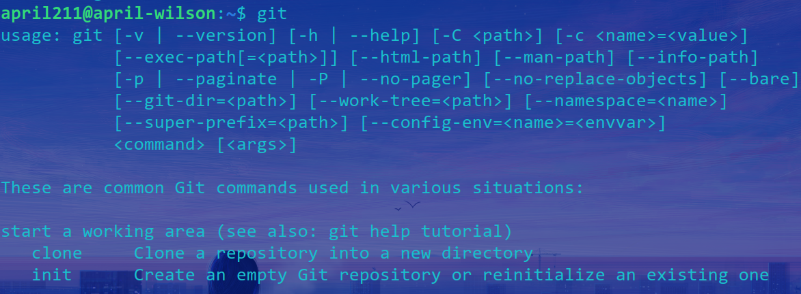
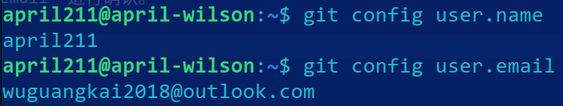

# 在 ubuntu 下对 git 进行简单的配置

2023/7/4 - april211

## 前言

其实之前学习过 `git` 的一些基本用法，也使用过它来进行一些仓库的版本控制。但是当时的任务很少涉及到多人协作的内容，相关的知识学得不是很扎实；另一方面是当时没有养成系统记录、写 Blog 的习惯，许多基础概念已经模糊不清，因此重新夯实一下这一重要工具的也能够发还是很有必要的。

## 环境检查

放一张我的机器的信息页。


因为Git的向后兼容性很好，所以不用太在意系统环境和Git版本，大部分命令和配置都是通用的。

*（PS：系统字体是 `Comic Sans MS Italic`）*

`which git` 输出：

```
/usr/bin/git
```

`git --version` 输出：

```
git version 2.43.0
```

此时，如果在 `Terminal` 中执行 `git` 命令行，将会出现如下类似提示性输出。



## 配置过程

在根据特定系统的Git安装指南完成安装后，需要对 `git` 的**全局**用户名和电子邮箱进行配置。参考 [博客链接](https://www.cnblogs.com/duanming/p/11830252.html)。

主要是使用下面的两行命令来完成：

`git config --global user.name "april211"`

`git config --global user.email "wuguangkai2018@outlook.com"`

在配置完成后，可以使用 `git config --global user.name` 以及 `git config --global user.email` 进行确认，如下图。



另外，该文还讲解了重新设置用户名和电子邮箱的方法，在上面命令行的基础上额外添加 ` --unset` flag 即可。

