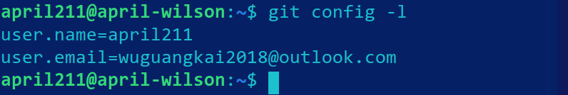
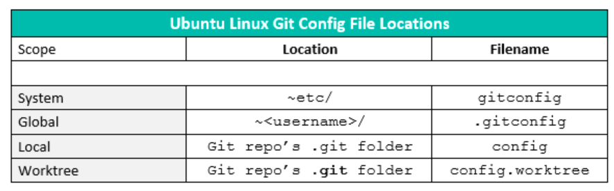
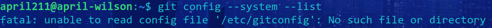
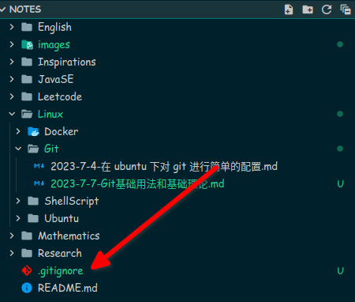

# Git基础用法和基础理论

2023/7/7 - april211

今天看[狂神的 Git 基础指南](https://mp.weixin.qq.com/s/Bf7uVhGiu47uOELjmC5uXQ)，感觉很不错，基础阶段建议大家都去看看，一定会有所收获。博文里面有几张图形象直观地阐明了 Git 的基础用法和理论知识，虽说这些只能应付日常的使用，但是这也是进阶的基础，是必须进行学习并通过实践来深化掌握的。

这里对这篇博文所描述的几个重点问题和知识点进行回顾和整理，并标记部分目前掌握程度还不够的地方，以供后续检查学习使用。部分图源来自狂神说微信公众号，一般带有水印（上文给出的分享链接中）。

## 补充上一篇缺失的几个命令

查看 Git 的本地配置表：`git config -l`



我这里的结果只有两项，如上图所示，可能是因为我之前的 [配置](./2023-7-4-在%20ubuntu%20下对%20git%20进行简单的配置.md) 里只设置了这两项。

Linux 下 Git 配置文件的位置（来自 [stackoverflow](https://stackoverflow.com/a/63257602/19336889)）：



但是当我输入`git config --system --list` 尝试查看 `/etc/gitconfig` 时，Git 报错，原因暂时未知（可能是我至今并没有进行系统级的配置？）：



关于库的初始化、克隆建库、查看工作区文件的状态等命令，可以看 [开头](#Git基础用法和基础理论) 提到的博客中的

> Git 项目搭建
> 
> Git 文件操作

部分的内容。

## Git 基础理论

### Git 本地的“三个区域”

- 工作目录（Working Directory）
- 暂存区（Stage/Index）
- 资源库（Repository 或 Git Directory）

本地的三个区域，加上 远程的 Git 仓库（Remote Directory），共计4个工作区域，如下图。


在受 Git 管理的项目目录中，有如下图所示的结构。


其中 `.git` 目录在使用 `git init` 命令初始化项目管理时被创建，该命令需要在需要进行管理的项目目录下被执行。

## Git 基础用法和工作流程

在上文提到的 [狂神的博文](https://mp.weixin.qq.com/s/Bf7uVhGiu47uOELjmC5uXQ) 中有讲到：

> git的工作流程一般是这样的：
> 
> １、在工作目录中添加、修改文件；
> 
> ２、将需要进行版本管理的文件放入暂存区域；
> 
> ３、将暂存区域的文件提交到git仓库。

文件在 4 个区域中的状态转换和相应的转换命令如下图所示。如果你在看`Pro Git` 等类似的指导书或者教程，在面对教程中所给出的 Git 命令行进行思考时，不妨看一看这张图，加深一下对 Git 各阶段、各命令之间关系的理解和记忆程度。


这里注意到两种 `diff` 的使用区别。这张图的上半部分（即箭头向右的部分）我比较熟悉，但是自己对图中关于 `pull`、`fetch`、`checkout` 的理解、学习和实践还不够，在今后要进一步加深。

日常使用，关注一下下面这张图里的 6 个命令就基本可以应付。**对命令的学习还是要多上手尝试操作，别拿很重要的、没有安全备份的目录练就行。**


另外，在项目目录中使用 `.gitignore` 文件，可以指定 Git 忽略掉哪一些文件，使得它们不在 Git 的管理范围之内，其所在文件目录位置如下图所示。



此文件有如下规则（引自 [狂神的博文](https://mp.weixin.qq.com/s/Bf7uVhGiu47uOELjmC5uXQ)：忽略文件 一节）：

> 1. 忽略文件中的空行或以井号（#）开始的行将会被忽略。
> 
> 2. 可以使用Linux通配符。例如：星号（*）代表任意多个字符，问号（？）代表一个字符，方括号（[abc]）代表可选字符范围，大括号（{string1,string2,...}）代表可选的字符串等。
> 
> 3. 如果名称的最前面有一个感叹号（!），表示例外规则，将不被忽略。
> 
> 4. 如果名称的最前面是一个路径分隔符（/），表示要忽略的文件在此目录下，而子目录中的文件不忽略。
> 
> 5. 如果名称的最后面是一个路径分隔符（/），表示要忽略的是此目录下该名称的子目录，而非文件（默认文件或目录都忽略）。

个人认为后两条解释地不太清楚，语句指代有点混乱。相比之下，`Pro Git` 一书中对应的讲解就格外简洁清晰了：

> 文件 .gitignore 的格式规范如下： 
> 
> - 所有空行或者以 # 开头的行都会被 Git 忽略。 
> - 可以使用标准的 glob 模式匹配，它会递归地应用在整个工作区中。 
> - 匹配模式可以以（/）开头防止递归。 
> - 匹配模式可以以（/）结尾指定目录。 
> - 要忽略指定模式以外的文件或目录，可以在模式前加上叹号（!）取反。

需要注意的是，`.gitignore` 中列举的多个规则是用来描述*一个抽象的、整体的*规则。这里一并附上 `Pro Git` 一书中举的例子：

```
# 忽略所有的 .a 文件 
*.a 

# 但跟踪所有的 lib.a，即便你在前面忽略了 .a 文件 
!lib.a 

# 只忽略当前目录下的 TODO 文件，而不忽略 subdir/TODO 
/TODO 

# 忽略任何目录下名为 build 的文件夹 
build/ 

# 忽略 doc/notes.txt，但不忽略 doc/server/arch.txt 
doc/*.txt 

# 忽略 doc/ 目录及其所有子目录下的 .pdf 文件 
doc/**/*.pdf
```

注意对取反操作的理解和使用。

以上提到的这些都只是单人的操作，没有考虑协同开发和使用多分枝的情况，私以为这才是 Git 的精髓和关键。
