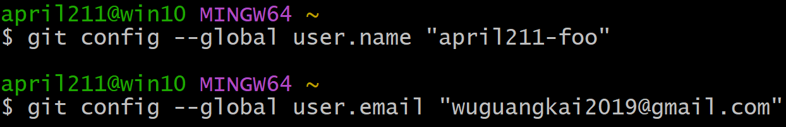
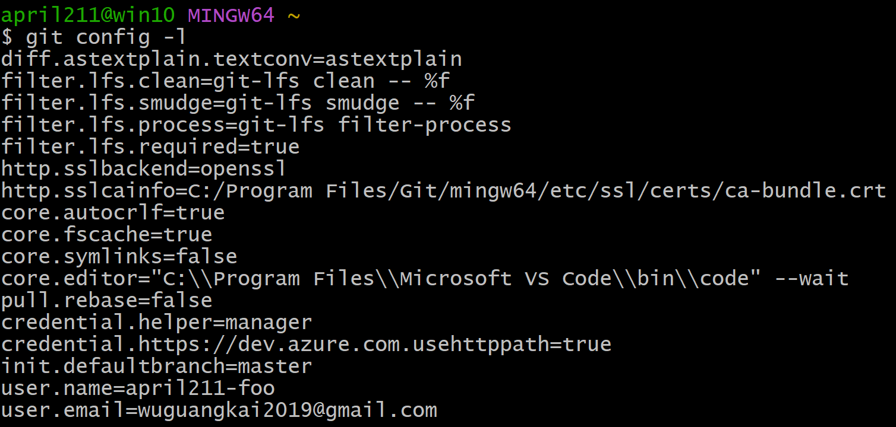

# Git协作开发练习基础篇-使用虚拟机完成

2023/7/7 - april211

## 前言

都知道 Git 是一个支持多人协同开发的版本控制系统，如果自己练习的时候都是单人模式，那就太不尽兴了吧！

我现在的机器装的是 Ubuntu，平时使用 VSCode 编辑代码、撰写随笔。另外值得一提的是，VSCode 中的版本控制用起来很顺手，GitLens 也很方便美观，真用起来几个按钮就搞定一切了。不过现在毕竟是要仔细地学习一番，总不能处处偷懒。正巧机器里有个 Windows 的 VBox 虚拟机可以用，这就立马往里面整了个 VSCode（用来代替记事本）和 Git，用我自己的邮箱小号设置了一下 Git，还用它新注册了一个 Github 账号，力求还原多人协作的真实场景。

这是我在 Windows 下设置的命令行：

Windows 端 Git 执行命令行 `git config -l` 获得输出：

可以看到，Windows 端的输出比之前在 Ubuntu 的输出要多不少。这可能是归因于我在安装时，在 Setup GUI 中调整了一些项导致的，也有可能是因为 Git 原生于 Linux，而 Windows 环境过于生草，Git 不得不提前配置一些参数才得以运行（笑

这是我创建的 Github 小号（笑：

之所以使用 VSCode 进行文本编辑，而不是 Windows 自带的记事本，主要是看了廖雪峰的 [这篇教程](https://www.liaoxuefeng.com/wiki/896043488029600/896827951938304) 所讲的原因：

> 使用Windows的童鞋要特别注意：
> 千万不要使用Windows自带的记事本编辑任何文本文件。
> 原因是Microsoft开发记事本的团队使用了一个非常弱智的行为来保存UTF-8编码的文件，他们自作聪明地在每个文件开头添加了0xefbbbf（十六进制）的字符，你会遇到很多不可思议的问题，比如，网页第一行可能会显示一个“?”，明明正确的程序一编译就报语法错误，等等，都是由记事本的弱智行为带来的。
> 建议你下载Visual Studio Code代替记事本，不但功能强大，而且免费！

简单来说是记事本太自作主张，VSCode yyds（笑

Windows 那边我打算完全使用命令行来完成各种 Git 操作，新装的 VSCode 仅用来编辑文本文件，这样也能锻炼一下使用 Git 命令行的能力，毕竟命令行才是原汁原味、能真正解决所有问题的！

好了，经过这番折腾，基本的练习环境已经搭建好了，就看我们能够构想出多少使用场景了。万事俱备，只欠东风～

未完待续... 明天接着肝... 

