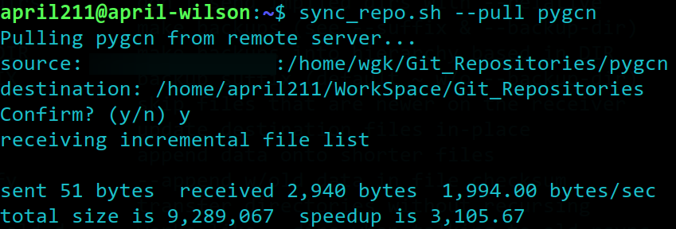
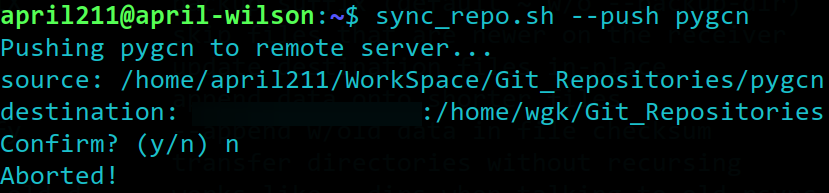

# 编写同步工作站和本机Git仓库的Shell脚本

2023/12/27 - april211

## 引子 & 需求

前段时间实验室引进了一个戴尔工作站，并且在学校内网设置好了 IP 地址（为了安全，本文中将以 `192.168.1.100` 代指工作站的内网地址）。

由于工作站上不方便安装科学工具，如果想要与 Github 上的代码仓库进行同步，就必须先将工作站上的 Git 仓库与本机先做一次同步，再利用本机上的科学工具，将该仓库同步至 Github 云端。

另外，大多数需要进行复现的代码仓库的 `clone` 过程需要在本地先执行，然后再传输到工作站上。代码仓库的 `commit` 等 Git 操作**均在工作站上完成**（本机使用 `VSCode` 远程等方式）。

所以这是一个**双向的数据同步问题**，而且最好还要考虑到网络流量开销，因为学校内网很垃圾……（

反复地敲长长的命令行太费事了，写个脚本就一劳永逸了😎

## 需要使用的命令

一开始我是使用 `scp` 指令来完成传输的，但是每次都要传输整个仓库的数据，就很慢很不爽！而且后来我遇到了一些文件权限问题？这些问题在使用 `rsync` 命令后都迎刃而解了～

## *Talk is cheap, show me the code!*

Alright~

```shell
#!/bin/bash

# sync_repo.sh <mode> <repo name>

mode=$1
repo_name=$2

if [ $mode = "--push" ]; then
    echo "Pushing $repo_name to remote server... "
    source="/home/april211/WorkSpace/Git_Repositories/$repo_name"
    destination="192.168.132.150:/home/wgk/Git_Repositories"
elif [ $mode = "--pull" ]; then
    echo "Pulling $repo_name from remote server..."
    source="192.168.132.150:/home/wgk/Git_Repositories/$repo_name"
    destination="/home/april211/WorkSpace/Git_Repositories"
else
    echo "Invalid mode!"
    exit 1
fi

echo "source: $source"
echo "destination: $destination"

read -p "Confirm? (y/n) " answer

if [ -n $answer ] && [ "$answer" != "y" ]; then
    echo "Aborted!"
else
    rsync -avz $source $destination
fi

exit 0
```

有以下几个点需要说明：

- 这个脚本设置了 `push` 和 `pull` 两种模式，对应于两种使用场景，并**在本机上执行**。工作站上的 Github 签名（用户名和邮箱）和本地的签名是完全一致的。

- 脚本首先确定同步的来源和目的地，这里我的需求就是**少打字**，并且我的代码仓库路径都是固定规划好的，所以只需要用户提供代码仓库的名字就可以确定好这两个的路径。

- 每次同步都是从 `source` 到 `destination` ，并且在真正实施同步操作之前会输出两个路径并**要求用户进行确认**。

- `rsync` 命令的命令选项，摘自 `man` 页和 `--help` 信息：
    > `-a`: The files are transferred in archive mode, which ensures  that  symbolic  links,  devices,  attributes,  permissions, ownerships, etc. are preserved in the transfer. 
    > 
    > `-v`: increase verbosity.
    > 
    > `-z`: Additionally, compression will be used to reduce the size of data portions of the transfer.

- 有个语法细节：由于用户倾向于直接回车而不进行仔细的确认，所以脚本需要通过判断字符串是否为空来屏蔽这种行为。这体现在判断用户输入时的复合条件判断。此外，关于第二个`$answer` 变量为什么需要加双引号的原因放在这里[^1]。

[^1]: https://stackoverflow.com/questions/13617843/unary-operator-expected-error-in-bash-if-condition

*我一开始实现时使用的是 `scp` 指令和 `rm` 指令，记得在试验**任何脚本**之前充分备份数据，**即使是你自以为知道在做什么的情况下！！**另外，如果 `if` 语句中的条件判断有**语法错**，脚本会**继续执行下去**，可能会触发意想不到的后果！所以还是充分备份数据！！*

写好脚本后，就可以这么使用了：





## 尾声

暂时先写到这里，有关 `rsync` 命令的详细讲解等到有空的时候再写吧～

