# Shell 脚本语法快速入门

2024/06/07 - april211

## 背景

这篇文章是我在 **2023 年 11 月**的研究生的分布式计算课上进行翻转课堂时所做的内容。本文以几个实例来讲解 Shell 脚本编程中的基本语法，尽量涵盖了大部分的基础语法知识，**个人觉得比较适合作为 Shell 脚本语法的入门教程**，故将讲稿整理成本文档，与各位分享。

**本文档的代码**目录链接：[Shell_Course](./Shell_Course/)

## Shell 简介

GNU/Linux shell 是 GNU/Linux 操作系统中的一个重要组成部分（GNU：Unix-like operating system），它提供了用户与操作系统内核进行交互的一种方式，它满足了用户运行程序、管理文件系统等需求。Shell 是一个命令行解释器，用户可以通过输入文本命令与系统进行通信。

Shell 的核心是命令行提示符。命令行提示符是 shell 负责交互的部分，它允许我们输入文本命令，然后解释命令，并在内核中执行。

Shell 包含了一组内部命令，用这些命令，我们可以完成诸如复制、移动、重命名文件、终止系统中正在运行的进程等十分有用的操作。除此之外，我们当然还可以在shell 中运行我们自己写的程序。

我们还可以将多个命令按照 shell 脚本的编写语法，放入到一个**脚本文件**中作为一个程序执行，它执行的过程与 Python 脚本的执行过程有相似之处。我们在命令行上执行的任何一个命令都可以放进一个 shell 脚本中，从而使得该脚本中包含有数条命令，并作为完成一个既定任务的一组命令执行。这显然省去了重复敲命令行的麻烦，**为开发面对复杂任务的、自动化的工具提供了便利**。 
 
实际上，在 Linux 早期，并没有桌面环境供用户使用。那时，人们就只能在 Linux 终端面前，通过敲击命令行、编写 Shell 脚本程序来完成管理操作系统、执行和停止作业等任务。

在 Linux 系统上，通常有好几种 Linux shell 可供用户使用，但是，所有的 Linux 发行版默认的 shell 都是 bash shell。所以**本次课将基于 ubuntu 系统中的 bash shell 来讲解 shell 程序设计**。

## Shell 与 Terminal

**Shell 和 Terminal 是两个相关但是完全不同的概念**。下面将介绍 Shell 与 Terminal 的区别和关系。

Shell 是一个**命令行解释器**，它允许用户与操作系统内核进行交互。它接收用户输入的命令并将其解释为操作系统能够理解的指令。Shell 提供了一个命令行界面，用户可以通过键盘输入命令，并通过文本输出获取结果。

Terminal 是一个提供**与 shell 交互**的图形界面或命令行界面的应用程序。**在图形用户界面（GUI）中，Terminal 通常是一个模拟控制台窗口**，用户可以在其中输入命令并查看输出。

从上面的解释中，我们不难看出他们两者之间的区别。而对于两者的关系，我们可以使用一句话进行概括：**终端实际上是一个用于运行 shell 的容器**。Shell 是一个命令解释器，而 Terminal 是一个用户界面，用于提供与 Shell 的交互。**Terminal 既可以是虚拟终端，也可以是物理终端**。

## 进入 Shell 的方法

### Linux 控制台

进入 CLI 的一种方法是让 Linux 系统退出图形化桌面模式，进入文本模式。在 ubuntu 上，通常使用 Ctrl+Alt+Fn 组合键进入文本模式。这样显示器上就只有一个简单的字符命令行界面，而不含有任何的图形界面。跟图形化桌面出现以前程序员们面对的状况基本一致。

### 图形化终端

除了让系统进入文本模式，还可以使用 Linux 图形化桌面环境中的终端仿真工具包。这种工具包会在图形交互环境中模拟控制台终端，创建出的终端通常表现为一个窗口，用户可以在这个窗口和其他的图形窗口之间自由切换。要想在桌面中使用命令行，关键在于图形化终端仿真器。可以把图形化终端仿真器看作是图形界面中的 CLI 终端，将虚拟控制台终端看作图形界面之外的 CLI 终端。

在本次课中，我们将使用 ubuntu 中的 GNOME Terminal 图形化终端仿真器来访问 Shell CLI。

### 如何运行多条命令？

相信大家都或多或少有一些 Linux 命令行的使用经验了。在处理很多的简单任务时，我们通常只是向 Shell 中输入了一条命令，执行它并观察运行结果是否符合预期。

但是在处理一些更为复杂的任务时，单条命令的表达能力就十分有限了，或者说在面对更为复杂的任务时，要求只使用一条命令来完成这个任务就显得有点强人所难了。

前面我们提到，我们可以把多条命令按照一定的语法规则整合放入到一个文件中，并送入Shell执行。这时，我们把这个文件叫做 Shell 脚本。通过 Shell 脚本，我们可以输入多个命令并处理每个命令的结果，甚至在必要时将一个命令的结果传给另一个命令进行进一步的处理。我们将在后面详细讲解这种用法。

但其实，我们可以在 Terminal 中一次输入多条命令，并执行它们。实现这一点的关键在于使用分号间隔符来 间隔多条命令。

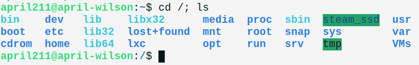

这时，我们也将这一次输入的多条命令称为一个Shell脚本。

通过编写 Shell 脚本，我们可以轻松地完成更为复杂的任务。

## 创建第一个Shell脚本

要将 shell 命令放到文本文件中，首先需要创建一个文件，它通常以 `.sh` 作为扩展名。然后我们就可以将多条命令通过文本编辑器来写入到这个文件中。

在创建 shell 脚本文件时，为了保证我们使用的是想要的 shell ，我们必须在文件的**第一行**显式地指定要使用的 shell ，就像这样：

```shell
#!/bin/bash
```

在通常的 shell 脚本中，在某一行的开头使用一个井号 `#` 表示注释掉这一行，而 shell 并不会处理 shell 脚本中的注释行，因此注释行将被忽略。另外，我们还可以使用井号在编写 Shell 脚本时添加必要的说明。然而，shell 脚本文件的第一行是个例外，用户可以使用这样的语句来告诉 shell 用哪个 shell 来运行脚本。

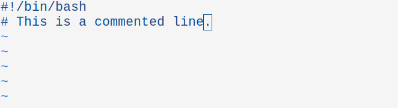

在写好第一行后，我们就可以敲击回车来编辑下一行，就像写 C 代码一样。在 shell 脚本中，我们可以在独立的行中书写命令。Shell 会按根据命令在文件中出现的顺序进行处理。

在这个脚本里面，我们在第二行使用注释语法输入一句话，在该脚本被执行时，这行将被完全忽略掉。

在保存好这个脚本并退出文本编辑器后，我们还需要使用 chmod 命令使得我们新编写的脚本获得可执行权限。随后，我们就可以使用一个简单的脚本执行命令来运行这个Shell 脚本了。

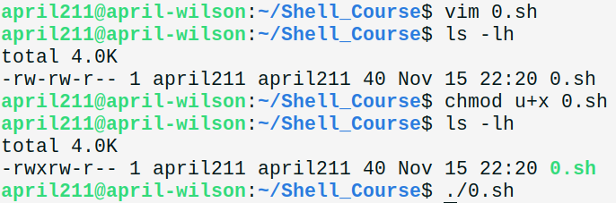

这个脚本并没有产生什么实际的作用，在 Terminal 中的输出也是一片空白。这符合我们的预期。

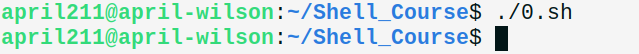

这里，请格外注意脚本执行命令的书写方法。如果我们直接使用 `0.sh` 来尝试执行这个 Shell 脚本，将会报错，提示找不到这个命令：

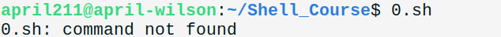

这是因为，我们并没有在系统 PATH 环境变量中加入当前路径。与之不同的是，在上面执行成功的命令中，我们为了引用当前目录下的文件，使用了单点操作符。这点需要注意。当然也可以在环境变量 PATH 中加入这个路径，从而使得 Shell 可以找到这个脚本文件。

## 几个 Shell 脚本编程的示例

现在，我们已经学会了如何创建和执行一个 Shell 脚本。接下来，我们将通过几个示例来学习 Shell 脚本的基本语法和 Shell 脚本的设计思路。

### 以天为单位创建记录指定目录的日志文件，并输出文件名中含有指定字符的文件信息

```shell
#!/bin/bash 
# 按照日期创建指定目录的日志

ymd=$(date +%y%m%d) 
flist=$(ls /usr/bin -1lh)
echo "$flist" > log.$ymd            # 加双引号保留换行

fname="zip"
cat log.$ymd | grep $fname

lc=$(echo "$flist" | grep "$fname" | wc -l)

echo -ne "Number of files have $fname in their names: $lc.\n"
exit 0
```

在上面这个简单的例子中，使用到了 Shell 脚本编程中**变量、命令替换、管道、重定向以及脚本退出状态返回**等知识。具体地，代码的前两行使用命令替换技术获取到了命令的输出结果，第三行使用 echo 和输出重定向技术将文件列表输出到磁盘文件中，第四、五行使用管道技术搜索文件中符合指定条件的行，代码最后的部分使用wc 命令对符合条件的搜索结果结果的个数进行了统计。

当运行这个脚本时，会在当前工作目录下生成一个以年月日为后缀名的日志文件，该日志文件记录了此次运行时 `/usr/bin` 目录下的所有文件的详细信息。需要注意的是，在选择输出重定向技术时，我们选择了覆盖模式，所以如果是在**同一天中**多次运行该脚本，最终只会保留最新一次运行的结果。

### 在尝试读取某个路径所指定的文件时，做必要的检查

```shell
#!/bin/bash 

pwfile=$1

if [ -f $pwfile ] ; then                # 检查 pwfile 是否存在并是一个文件
    if [ -r $pwfile ] ; then            # 检查 pwfile 是否存在并可读
        more $pwfile 
    else 
        echo "用户没有对文件 $pwfile 的读权限！" 
    fi 
else 
    echo "文件 $pwfile 不存在！" 
fi

exit 0
```

在这个例子中，我们使用了**脚本参数、流程控制与测试语句**等知识。具体地，Shell 允许我们在执行脚本时加入附加的参数，来使得我们的脚本可以接收用户指定的变量值。在这里，用户需要在执行脚本时输入一个路径参数，这个路径参数被Shell的参数变量$1所捕获。我们随后使用 if 语句和 test 测试语句来测试路径，并在文件存在且可读的情况下，使用 more 命令读取该文件的内容。如果路径不满足某些条件，脚本将会在 Terminal 上使用 echo 打印出提示信息。

请注意，**在 Shell 脚本中的 if 语句与 C 语言中的 if 语句有不同之处**：Shell 脚本中的 if 语句后面跟着一条命令，该命令会返回一个状态码，当且仅当该返回状态码为 0 时，if 对应的 then 代码块才会被执行；而 C 语言中的 if 语句后面跟的是一个条件表达式，当表达式取 0 时，if 对应的代码块反而不会执行。

测试语句test（或者是这里使用的方括号）可以帮助 if 语句检查数值、文件、字符串相关的条件以及由简单条件经过布尔运算而形成的复合条件，正是因为 test 仅对成立的条件返回 0。它针对不同类型的数据有许多不同的测试 flags，可以在必要时通过手册查询。

其实，还有一种方法可以帮助if来完成针对数学表达式的测试，这种方法被称作双括号语法。举例如下。

```shell
#!/bin/bash 

a=40

if (( $a ** 2 == 1600 )); then
    echo "$a ** 2 == 1600 is True!"
else
    echo "$a ** 2 == 1600 is False!"
fi

exit 0
```

这个 Shell 脚本使用双括号语法，对 40 的平方是否等于 1600 进行了测试。这种方法与 C 语言中的方法就很相似了。其输出结果如下。

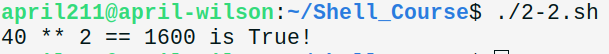

另外，如果需要根据某个变量的取值来采取不同的措施，使用 case 语句会比 if 语句看起来简洁很多，例如下面给出的这个例子。

```shell
#!/bin/bash 

USER_foo="testing"

case $USER_foo in 
april211 | wilson)
    echo "Welcome, $USER_foo! Enjoy your visit!";;
testing)
    echo "This is a special account for testing.";;
*)
    echo "Sorry, you are not allowed here... ";;
esac

exit 0
```

在这个例子中，我们使用了 case 语句来判断用户名变量的值，并做出相应的措施。这种写法显然比与之等价的 if 语句的写法要简洁得多。

语法细节上有几点需要注意：case 的选项是另起一行的，以右括号作为结尾，并且可以使用多个选项，选项之间需要使用竖线分隔开；每个选项所对应的代码块中，最后一行需要加上两个分号作为结尾，其他行直接写命令就行，不需要添加其他的符号；最后一个选项可以使用通配符星号 `*`，用来匹配变量所有剩余的可能取值，并在对应的代码块中做出必要的处理；case 语句使用 case 单词的倒写形式 esac 作为结尾，以表示此语句书写完成。

关于命令行参数，其实还有许多很有用的技巧，这里使用示例脚本进行讲解。

```shell
#!/bin/bash 

# ./all_params.sh 1 2 3 4 5 6 a s d f g h

echo "The command line of this execution: $0"
echo "The basename of this script: $(basename $0)"
echo "# of params: $#."
echo "The 1st param: $1"
echo "The 11th param: ${11}"
echo "The last param: ${!#}"

count=1

for param in "$*"; do
    echo "\$* Parameter #$count = $param"
    count=$[ $count + 1 ]
done

echo

count=1

for param in "$@"; do
    echo "\$@ Parameter #$count = $param"
    count=$[ $count + 1 ]
done

exit 0
```

执行结果如下。

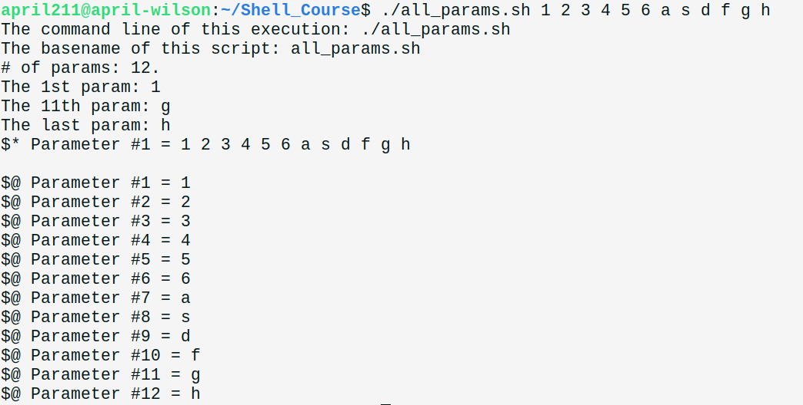

（讲解：特殊的命令行参数的使用方法）

```shell

#!/bin/bash 

# ./getopt.sh -v -w test1 -xz test2 test3 test4

echo "$@"

getopt -q vw:xz "$@"

echo "$@"

set -- $(getopt -q vw:xz "$@")    # 使用 set 改变命令行参数的值
echo "$@"

while [ -n "$1" ]; do
    case "$1" in
    -v) echo "Found the -v option";;
    -w) param="$2"
        echo "Found the -w option, with parameter value $param"
        shift;;                   # 参数列表左移，丢弃该参数
    -x) echo "Found the -x option";;
    --) shift 
        break;;                   # -- 后面是固定的参数，而不是选项
     *) echo "$1 is not an option";;
     esac
    shift
done

count=1
for param in "$@"; do 
    echo "Parameter #$count: $param"
    count=$[ $count + 1 ]
done

exit 0
```

执行结果如下。

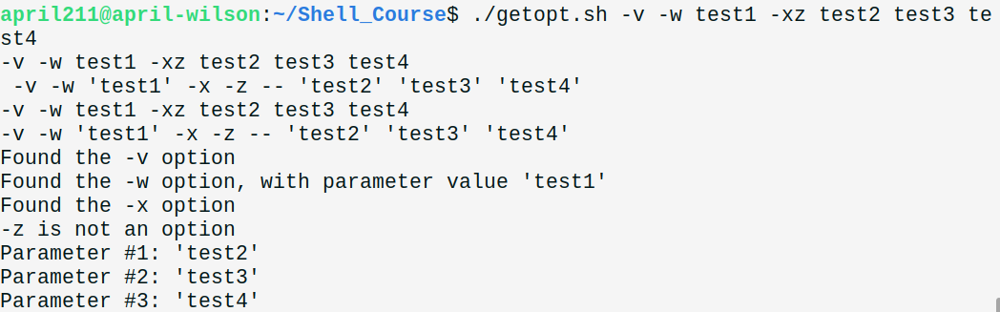

（讲解：set、getopt 的使用方法，Linux 命令行参数和选项的标准格式，解析命令行的思路）

### 检查指定目录下的所有文件和目录的大小

```shell
#!/bin/bash 

dir="/home/april211/Shell_Course/*"

for path in $dir; do
    if [ -e "$path" ]; then
        size_name=$(du -ks "$path")          # KB
        size=$(echo "$size_name" | cut -f 1)
        if [ $size -ge 100 ]; then
            echo "$path"
        fi
    fi
done

exit 0
```

在这个示例中，我们检查了指定目录下所有文件和目录的大小，并将大于 100KB 的项所对应的路径全部输出。在这个例子中，我们使用到了**for 循环结构**和 du、cut 等常见的命令。这里 for 循环的写法与 Python 中的写法很相似。我们在 in 的后面使用通配符指定了一个目录，并且使用 for 循环来遍历这个目录下的所有项（文件和目录）。我们使用 du 命令和字符串处理命令 cut 来获取文件或者目录的总大小，并使用 test 语句来判断该项的大小是否大于等于 100KB。如果条件满足，则输出该项的路径。需要注意的是，在 Linux 中，目录名和文件名带有空格是合法的，所以在使用遍历得到的路径变量时，需要在它左右加上双引号。

这里，我们使用了 Shell 风格的 for 循环写法。其实，我们还可以使用一种接近于 C 风格的写法，这种写法在某些情况下比上一中写法要更顺手、简简洁。例如下面这个简单的例子。

```shell
#!/bin/bash 

for (( a=1, b=8; a <= 8; a++, b-- )); do
    if (( a == 4)) || ((a == 5)); then
        continue
    fi
    echo "$a - $b = $[ $a - $b ]"
done

IFS=$'\n'

```

可以看出，这个 for 循环的风格更加接近 C 语言的写法。在这个例子中，我们在 for 循环中使用了多个迭代变量（a、b），并且使用 continue 语句跳过了其中的两个迭代步骤。此外，我们在书写 C 语言风格的 for 循环时，并不需要遵守变量与运算符连续的规则（例如上面代码中的 `a <= 8`）。这个 Shell 脚本的输出如下。

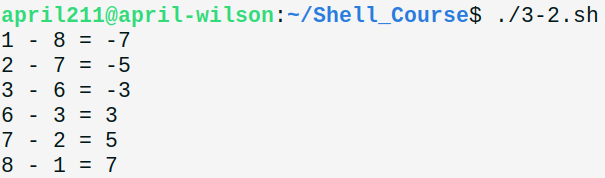

可见，a 等于 4 和 5 的两次迭代被脚本成功跳过了。

### 读取一个文件的前5行文字

```shell
#!/bin/bash 

iter=1

while IFS='' read -r line
        [ $iter -le 5 ]; do
    echo "$iter: $line"
    iter=$[ $iter + 1 ]
done < log.231116

exit 0
```

在这个例子中，我们使用了控制间隔符的 **IFS 环境变量、while 循环结构、Shell 学运算语法以及输入重定向技术**，输出了我们前面所创建的日志文件的前5行内容。这里有些重要的细节需要说明。我们指定 IFS 为空字符串，是为了防止 read 命令在读取文本时，将每一行中的空格当作间隔符处理，从而获得原有的文本；给read 命令指定 -r 参数，是为了不让可能出现的反斜杠发挥转译功能； while 的判断条件中使用了多个测试命令，每一个测试命令需要单独放到一行上；我们还使用了 Shell 脚本的方括号数学运算语法，计算了证整数迭代变量 iter 的数值。

我们现在通过 **break 语句**，将控制行数的测试命令放到循环里面去。

```shell
iter=1

while IFS='' read -r line; do
    echo "$iter: $line"
    iter=$[ $iter + 1 ]
    if [ $iter -gt 5 ]; then
        break
    fi
done < log.231116

exit 0
```

注意测试命令中的比较方式发生了变化，是因为我们现在不是让 while 循环在条件成立时继续运行，而是让 while 循环在条件不成立时停止运行。这两个代码的运行结果是完全一样的，都是输出指定文本的前5行。

还有一点值得注意：Shell 编程中的 break 语句可以一次性跳出多个循环，只需要在 break 语句后添加一个参数 n，就像下面这个双层 for 循环的例子一样。

```shell
#!/bin/bash 

for (( i = 1; i <= 6; i++)); do
    echo "Outer loop: i == $i."
    for (( j = 1; j <= 6; j++)); do
        echo "Inner loop: j == $j."
        if (( j == 3 )); then
            echo ""                 # print a blank line
            break 2
        fi
    done
done >> output.iter

exit 0
```

在这个例子中，我们嵌套使用了 for 循环，并且让脚本在每层循环进入一次迭代后，立即输出所属层迭代变量的值。可以看到，我们在内层循环中，设置了一个 break 语句，并将其层级参数**n 设置为 2**（如果不设置，n的值就默认为1，也就是我们所熟悉的情况）。这样，当内层的迭代变量 j 等于 3 时，就会触发 break 命令的 if 测试条件，从而**一次性终止内外两层循环**。最后，我们还**针对 for 循环使用了输出重定向技术**，以**附加模式**将脚本的输出打印到了文件 `output.iter` 中。

下面是这个脚本**重复执行两次**的输出情况，符合我们的预期。

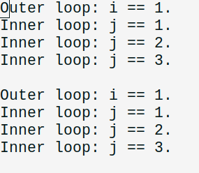

### 使用Shell脚本进行浮点数学运算

在前面的例子中，我们已经使用方括号数学运算语法进行了一个很简单的整数加法运算。那么，我们能不能用它来处理更复杂的浮点类型的数据呢？

答案是**否定的**。这种语法只允许我们对整数进行数学运算，而不能得到的较为精确的浮点运算结果。我们可以写一个 Shell 脚本来验证一下。

```shell
#!/bin/bash 

a=120
b=55

res=$[ $a / $b ]

echo "The result of \`$a / $b\` is: $res."

exit 0
```

这里，我们打算计算得出 120 除以 55 的精确浮点结果，但是结果却是：

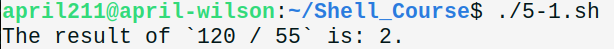

可见，这种语法并不能支持我们进行浮点运算，我们需要另寻出路。如果我们确实需要在 Shell 脚本中执行浮点运算，我们可以使用 **bc 命令**来实现，就像下面这样。

```shell
#!/bin/bash 

a=120
b=55

res=$( echo "scale=6; $a / $b"  | bc )

echo "The result of \`$a / $b\` is: $res."

exit 0
```

对应的运算结果如下。

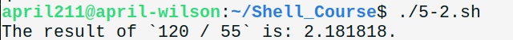

在上面这个例子中，我们使用 bc 命令计算得出了我们想要的浮点数结果，有两个比较关键的点：首先，bc 命令默认的精度是整数精度，也就是和我们的方括号计算语法一样，我们需要显式地使用 scale 选项设置我们需要的浮点数计算精度；其次，bc 命令是一个交互式命令，因此在这里使用 echo 和管道技术是必要的。

但是还有一个问题：我们每进行一步浮点运算，都要像上面那样使用命令提取语法来获得 bc 命令的计算结果，当我们需要面对更为复杂的计算任务时，这种书写方式就显得格外的繁琐和冗长了。关于这个问题，我们可以在 Shell 脚本中使用**内联输入重定向**方法，来使得我们可以直接在 bc 命令中计算多个表达式的值。具体写法如下。

```shell
#!/bin/bash 

a=120
b=55
c=1600
d=80

res=$(bc << EOF
scale = 9
var1 = $a + $d
var2 = var1 / $b
sqrt($c) * var2 + 1
EOF
)

echo "The result is: $res."

exit 0
```

由此，我们可以获得如下的结果。

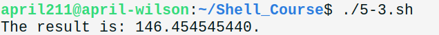

这里有几个需要注意的点：第一，我们使用了内联输入重定向方法来向 bc 命令送入我们的输入，注意与前面介绍的输入重定向相区分（是一个“远小于号”），并且设置了一个停止字段 EOF；第二，我们使用在 bc 命令内部定义的变量（上图中的 var1、var2）是不需要加上美元符号来取值的，而是直接书写变量名就行，与之相反的，当我们在使用 Shell 脚本中定义的变量时，就必须要使用美元符号 `$`；第三，我们在这里使用了一个 bc 命令内置的函数 sqrt，但是实际上 bc 内置的函数十分匮乏，如果真的需要计算一个没有内置的数学函数的值，就需要使用 bc 的函数定义语法来自己实现该函数。

### 交互式地接收用户密码输入

为了保护用户的数据安全，在输入密码时，常常要求脚本隐藏用户的实际输入。这一点可以通过设置 read 参数实现。

```shell
#!/bin/bash 

passwd_foo="123456"

# -t 10

read -p "Do you really want to login right now [Y/N] ? " answer

count=0
max_count=3

case $answer in 
Y | y) while [ $count -lt $max_count ]; do 
            read -p "Enter your password: " -s passwd_input
            if [ $passwd_input = $passwd_foo ]; then 
                 echo "Successfully login to the system!"
                 break
            else
                 count=$[ $count + 1 ]
                 echo "Wrong password! ($count/$max_count)"
            fi
       done;;
N | n) echo "You cancel the login.";;
    *) echo "Illegal input!";;
esac

exit 0
```

在这个例子中，我们模拟了登陆系统要求用户输入密码的交互场景。我们为了隐藏用户输入，对 read 命令使用了 `-s` 选项。模拟过程会计算用户输入密码错误的次数，达到错误上限后就会自动退出脚本。

### 使用递归函数计算阶乘

Shell 脚本允许我们使用函数来实现代码的重用，并且支持递归地执行函数。

递归函数的一个经典例子就是计算阶乘。这里我们使用 Shell 脚本来实现它。

```shell
#!/bin/bash 

function factorial {
    if [ -z "$1" ]; then
        return 3
    fi

    if (( $1 == 1 )); then 
        echo 1
    else
        local temp=$[ $1 - 1 ]
        local result=$(factorial $temp)
        echo $[ $1 * $result ]
    fi
}

# if (( $# != 1)); then
#     echo "Illegal input! Failed to calculate!"
#     exit 1
# fi

ans=$(factorial $1)
return_code=$?

if (( $return_code == 0 )); then
    echo "The factorial of $1 is: $ans."
else
    echo "Illegal input! Failed to calculate!"
    echo "Return code of factorial function: " $return_code
fi 

```

在函数 factorial 中，使用 echo 命令返回计算结果，而使用 return 返回函数状态码。非零的函数状态码通常表明函数的运行出现了问题，这里 factorial 函数对空输入返回状态码 3。在该函数中，递归地调用了自身，并且使用命令提取语句获取了函数的运算结果。

## 参考文献

[1] Richard Blum and Christine Bresnahan, Linux命令行与shell脚本编程大全, 3rd ed. 人民邮电出版社, 2016.

