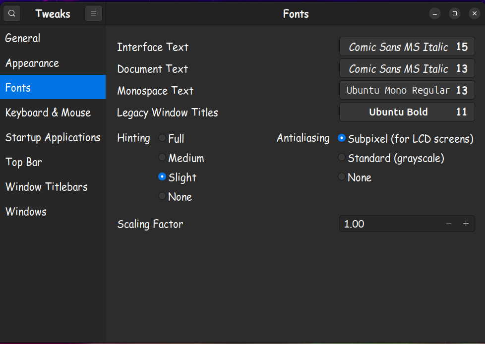

# 列表语法

这部分比较简单，属于 Markdown 最基础用法。

这里的大部分内容来自 [Markdown 官方教程 - Markdown 列表语法](https://markdown.com.cn/basic-syntax/lists.html#markdown-%E5%88%97%E8%A1%A8%E8%AF%AD%E6%B3%95)，我摘录了一些重点知识和示例，稍加练习就能上手了。

需要注意的是，有些语法结构是可以使用多种控制字符来实现的，但是我们最好**固定地使用其中的一种**，这对提高上手速度、专注于写作本身有着很大的益处，也符合 Markdown 的设计初衷。

## 有序列表

官网示例：

```
1. First item
2. Second item
3. Third item
4. Fourth item
```

渲染效果：

1. First item
2. Second item
3. Third item
4. Fourth item

## 无序列表

> Markdown applications don’t agree on how to handle different delimiters in the same list. For compatibility, don't mix and match delimiters in the same list — **pick one and stick with it**.

这里选择使用 `-` 来实现无序列表语法结构。

官网示例：

```
- 列举1
- 列举2
- 列举3
- 列举4
```

渲染效果：

- 列举1
- 列举2
- 列举3
- 列举4

## 在列表中嵌套其他元素

> 要在保留列表连续性的同时在列表中添加另一种元素，请将该元素**缩进四个空格或一个制表符，并构成段落**。

### 段落

官网示例：

```
- This is the first list item.
- Here's the second list item.

    I need to add another paragraph below the second list item.（左侧与各列举项对齐）

- And here's the third list item.
```

注意上面的示例中，`I need to add ... ` 一句的前面是**4**个空格。

渲染效果：

- This is the first list item.
- Here's the second list item.

    I need to add another paragraph below the second list item.（左侧与各列举项对齐）

- And here's the third list item.

### 引用块

官网示例：

```
- This is the first list item.
- Here's the second list item.

    > A blockquote would look great below the second list item.

- And here's the third list item.
```

渲染效果：

- This is the first list item.
- Here's the second list item.

    > A blockquote would look great below the second list item.

- And here's the third list item.

### 代码块

> 代码块通常采用四个空格或一个制表符缩进。当它们被放在列表中时，请将它们**缩进八个空格或两个制表符**。

官网示例：

```
1. Open the file.
2. Find the following code block on line 21:

        <html>
          <head>
            <title>Test</title>
          </head>
        <html>

3. Update the title to match the name of your website.
```

渲染效果：

1. Open the file.
2. Find the following code block on line 21:

        <html>
          <head>
            <title>Test</title>
          </head>
        <html>

3. Update the title to match the name of your website.

### 图片

Markdown 可以从本地路径和网络链接中获取图像数据，并支持将图片加入到列表中。

给出示例如下：
```
1. This is the first line.
2. This is the second line.

    
    

3. This is the third line.
```

渲染效果：
1. This is the first line.
2. This is the second line.

    
    

3. This is the third line.

### 列表（嵌套）

> You can nest an unordered list in an ordered list, or vice versa (with 4 spaces).

官网示例：

```
1. First item
2. Second item
3. Third item
    - Indented item
    - Indented item
4. Fourth item
```

渲染效果：

1. First item
2. Second item
3. Third item
    - Indented item
    - Indented item
4. Fourth item

