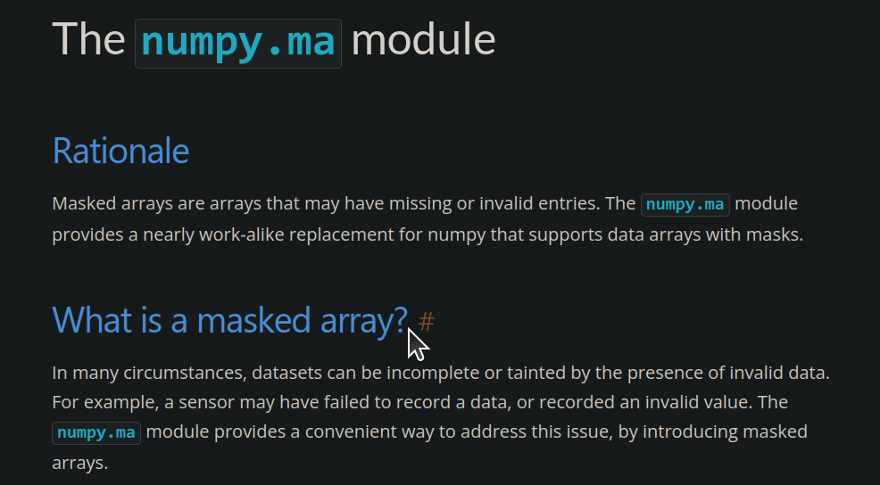
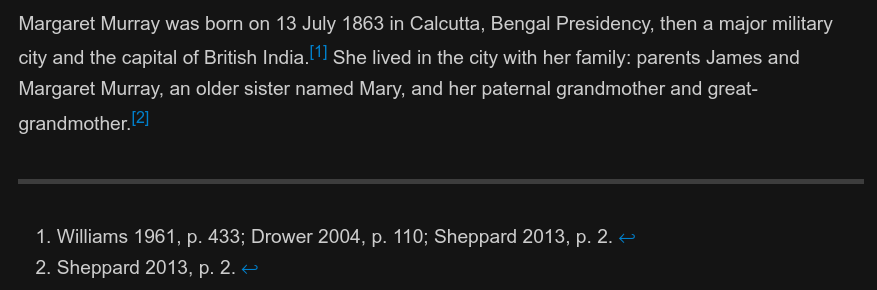
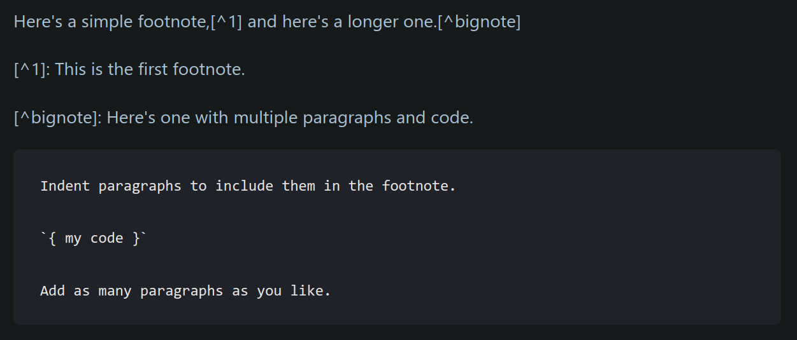

# 分隔线语法

使用 空行 + `---` + 空行 的方法添加分隔线（水平线）。

键入如下 Markdown 代码，案例来自 [Markdown 官方教程 - Markdown 分隔线语法](https://markdown.com.cn/basic-syntax/horizontal-rules.html#markdown-%E5%88%86%E9%9A%94%E7%BA%BF%E8%AF%AD%E6%B3%95)：

```
Try to put a blank line before...

---

...and after a *horizontal rule（译：水平线）*.

```

渲染效果如下：

Try to put a blank line before...

---

...and after a *horizontal rule（译：水平线）*.

# 删除线语法

使用 `~~` + 要被划去的内容 + `~~` 来构造删除线（strikethrough）语法结构。

键入 Markdown 代码如下：

```
~~这是要被删除线划去的内容~~
```

渲染效果如下：

~~这是要被删除线划去的内容~~

注意：～～中文的波浪线是不管用的～～

# 下划线语法

要在 Markdown 文本中使用下划线，你需要使用 HTML 的 `<ins>` 标签来实现这一点。

键入 Markdown 代码如下：

```
<ins>look at me now</ins>
```

渲染效果如下：

<ins>look at me now</ins>

不过 Markdown 并不建议使用下划线语法，这是因为它的渲染结果可能与人们熟知的超链接相混淆。可以去看一下 StackOverflow 上的 [相关讨论](https://stackoverflow.com/questions/3003476/get-underlined-text-with-markdown)。

---

# 链接语法

## 基础用法

[Markdown 官方教程 - Markdown 链接语法](https://markdown.com.cn/basic-syntax/links.html#markdown-%E9%93%BE%E6%8E%A5%E8%AF%AD%E6%B3%95) 中指出：

> 链接文本放在中括号内，链接地址放在后面的括号中，链接 title 可选。
> 
> 超链接 Markdown 语法代码：`[超链接显示名](超链接地址 "超链接title")`
> 
> 其中，链接文本放在中括号内，链接地址放在后面的括号中，链接 title 可选； title 在鼠标悬停在链接上时，以 comments 的形式显示。
> 

给出示例代码如下：

```
[Markdown 官方教程 - Markdown 链接语法](https://markdown.com.cn/basic-syntax/links.html#markdown-%E9%93%BE%E6%8E%A5%E8%AF%AD%E6%B3%95 "Markdown 链接语法")
```

渲染效果如下：

[Markdown 官方教程 - Markdown 链接语法](https://markdown.com.cn/basic-syntax/links.html#markdown-%E9%93%BE%E6%8E%A5%E8%AF%AD%E6%B3%95 "Markdown 链接语法")

这是一种很常用的 Markdown 语法结构。

## 使用链接并展示目标网址（例如Email地址）

使用一对尖括号 `<>` 包含一段链接，就可以把链接地址变成渲染时完全展示的、可点击的链接。

结合 [Markdown 官网教程](https://markdown.com.cn/basic-syntax/links.html#%E7%BD%91%E5%9D%80%E5%92%8Cemail%E5%9C%B0%E5%9D%80) 给出示例如下：

```
<https://markdown.com.cn>

<https://github.com/april211/Notes>

<wuguangkai2018@outlook.com>
```

渲染效果如下：

<https://markdown.com.cn>

<https://github.com/april211/Notes>

<wuguangkai2018@outlook.com>

## 创建带格式的链接

显示名加粗，注意不能仅对显示名格式化，需要对整个链接语法格式化：

```
I love supporting the **[EFF](https://eff.org)**.
```
I love supporting the **[EFF](https://eff.org)**.

显示名斜体，两种方法，与上面不同，应该是取决于渲染器的特性：

```
This is the [*Markdown Guide*](https://www.markdownguide.org).

This is the *[Markdown Guide](https://www.markdownguide.org)*.
```

This is the [*Markdown Guide*](https://www.markdownguide.org).

This is the *[Markdown Guide](https://www.markdownguide.org)*.

使用文本内转移链接 (tag)，并使用反引号`` ` ``：

See the section on [`链接语法`](#链接语法).

## 利用#号实施精准的跳转

将链接设置为另一文件的某一级标题：

```
[这是指向 说明文档-知识点安排 的链接](./description.md#知识点安排)
```

[这是指向 说明文档-知识点安排 的链接](./description.md#知识点安排)

这一方法对含有 Toggle 功能的网页也是有效的。例如对于 [Numpy 英文文档中的这个页面](https://numpy.org/doc/stable/reference/maskedarray.generic.html#)，在将鼠标移至每个标题附近时，会出现 `#` 号，如下图。



此时使用鼠标点击该 `#` 号，就能发现浏览器地址栏发生了变化，如下图。


我们只需要将变化后的网页链接 copy 到我们需要的地方就行了。有时是聊天对话框，有时是 Markdown 编辑器（笑

```
https://numpy.org/doc/stable/reference/maskedarray.generic.html#what-is-a-masked-array
```

[现在试着打开这个新的网页链接](https://numpy.org/doc/stable/reference/maskedarray.generic.html#what-is-a-masked-array)，会发现直接跳转到了 `What is a masked array?` 这一个标题下，而不像以前那样，[跳转到网页顶部](https://numpy.org/doc/stable/reference/maskedarray.generic.html#)。这算是一个很实用、但是很细节的小技巧。

使用时需要注意链接中空格的处理方法，推荐使用 `%20` 表示空格：

```
[example link](https://www.example.com/my%20great%20page)

<https://www.example.com/my%20great%20page>
```

[example link](https://www.example.com/my%20great%20page)

<https://www.example.com/my%20great%20page>

## 引用

在 Markdown 中，将引用视一种特殊的链接。

根据 [Markdown 官网教程](https://markdown.com.cn/basic-syntax/links.html#%E5%BC%95%E7%94%A8%E7%B1%BB%E5%9E%8B%E9%93%BE%E6%8E%A5) 给出的定义，

> 参考样式链接被定义为两部分：
> 
> - 与文本保持**内联**的部分
> - **存储在文件中其他位置**的部分
> 
> 以使得文本更易于阅读。

对应地，Markdown 引用链接的语法也分成了两个部分。

### 引用链接的第一部分

[这是需要引用的部分][1]。这个引用链接是一个网页链接，所以如果你在渲染出的文本中点击该链接，就会直接跳转到对应的浏览器网页（**注意不是跳转到引用链接的第二部分**）。

*据 [Markdown 官网](https://markdown.com.cn/basic-syntax/links.html#%E9%93%BE%E6%8E%A5%E7%9A%84%E7%AC%AC%E4%B8%80%E9%83%A8%E5%88%86%E6%A0%BC%E5%BC%8F) 建议，第一组方括号和第二组方括号之间最好留一个空格，但是这在[我的环境](./description.md#我的环境配置)中破坏了引用链接。所以在发布自己的 Markdown 给别人看之前，一定要事先了解、试验一下目标渲染器的特性，避免影响最终的阅读体验。*

### 引用链接的第二部分

[1]: https://en.wikipedia.org/wiki/Hobbit#Lifestyle

引用链接的第二部分在我的环境配置下并不会显示出来，如下图：


实际上，第二部分是这样书写的：

```
[1]: https://en.wikipedia.org/wiki/Hobbit#Lifestyle
```

第二部分所有的书写方式：

```
[1]: https://en.wikipedia.org/wiki/Hobbit#Lifestyle
[1]: https://en.wikipedia.org/wiki/Hobbit#Lifestyle "Hobbit lifestyles"
[1]: https://en.wikipedia.org/wiki/Hobbit#Lifestyle 'Hobbit lifestyles'
[1]: https://en.wikipedia.org/wiki/Hobbit#Lifestyle (Hobbit lifestyles)
[1]: <https://en.wikipedia.org/wiki/Hobbit#Lifestyle> "Hobbit lifestyles"
[1]: <https://en.wikipedia.org/wiki/Hobbit#Lifestyle> 'Hobbit lifestyles'
[1]: <https://en.wikipedia.org/wiki/Hobbit#Lifestyle> (Hobbit lifestyles)
```

你可以按照自己的喜好和需求，将引用链接的第二部分放在 Markdown 文档中的**任何位置**。

## 图片链接

有关图片链接的基本用法已经在 [ex1](./ex1.md#图片) 中给出，这里参考 [Markdown 官网教程 - 链接图片](https://markdown.com.cn/basic-syntax/images.html#%E9%93%BE%E6%8E%A5%E5%9B%BE%E7%89%87) 一文，给出一种对渲染的图片加链接的方法。

示例：

[](https://github.com/april211/Notes)

仔细看上面的写法，实际上是一种**嵌套构造**的思想：先构造图片渲染语句，随后将该语句作为显示名称，填入到网址链接对应的那一组方括号中，最后给出图片的网址链接（*这里设置为本仓库的 Github 网址*）。

## 脚注链接

*注意：脚注语法被 Markdown 官网列为扩展语法，使用时应当先查看自己所用的语法解释器 (parser) 的说明书。*

脚注链接与上文介绍的 [引用链接](#引用) 在语法结构上相似，但是其表现行为完全不同，在使用时应当注意区分。

脚注链接的语法结构也分为两个部分。与引用链接不同的是，点击脚注链接会跳转到文档内对应的脚注链接的第二部分，而不是会跳转到浏览器页面。

下面使用 [Wikipedia - Margaret Murray](https://en.wikipedia.org/wiki/Margaret_Murray#Early_life) 中的一段话作为示例来做说明。

输入 Markdown 代码如下：

```
Margaret Murray was born on 13 July 1863 in Calcutta, Bengal Presidency, then a major military city and the capital of British India.[^1] She lived in the city with her family: parents James and Margaret Murray, an older sister named Mary, and her paternal grandmother and great-grandmother.[^2]

[^1]: Williams 1961, p. 433; Drower 2004, p. 110; Sheppard 2013, p. 2.

[^2]: Sheppard 2013, p. 2.
```

这段 Markdown 代码在你的配置中渲染效果如下：

Margaret Murray was born on 13 July 1863 in Calcutta, Bengal Presidency, then a major military city and the capital of British India.[^1] She lived in the city with her family: parents James and Margaret Murray, an older sister named Mary, and her paternal grandmother and great-grandmother.[^2]

[^1]: Williams 1961, p. 433; Drower 2004, p. 110; Sheppard 2013, p. 2.

[^2]: Sheppard 2013, p. 2.

在我的配置下的显示效果如下（**在添加这句话之前**）。



可以观察到，**上面那段 Markdown 渲染得到的脚注的第二部分被安排到了文章的末尾，而不管它实际被书写在何处**。这无疑方便了我们的书写过程。

另外，[Markdown 官网 - Markdown 脚注](https://markdown.com.cn/extended-syntax/footnotes.html#markdown-%E8%84%9A%E6%B3%A8) 一文中提到了标识符的书写问题。我们在书写标识符时，可以不使用惯用的 `1, 2, 3 ... ` 这样的数字标识符，而是可以**使用其他字符来作为标识符** [^就像这样]。但遗憾的是，这在我的环境配置、以及 Github 下并不能奏效，生成的脚注最后还是被数字序列化了…… 不过这样书写有一个好处，就是我们**不必担心编号的顺序问题了**，Markdown 会替我们解决。*试想你如果写的时候使用数字序列编号，那你肯定会想着自己编好顺序对吧…… 这也给文档新增内容时脚注编号的处理带来了方便。*

[^就像这样]: Markdown 官网 - Markdown 脚注: https://markdown.com.cn/extended-syntax/footnotes.html#markdown-%E8%84%9A%E6%B3%A8

你应当可以观察到，上面刚新增的脚注的第二部分被附加到了本文的最后，也就是前面那段 Markdown 代码所生成的脚注的第二部分的后面。

对于 Github 所支持的 Markdown 风格，该规则也同样适用。[参考链接](https://docs.github.com/en/get-started/writing-on-github/getting-started-with-writing-and-formatting-on-github/basic-writing-and-formatting-syntax#footnotes)

> Note: The position of a footnote in your Markdown does **not** influence where the footnote will be rendered. You can write a footnote right after your reference to the footnote, and **the footnote will still render at the bottom of the Markdown**.
> 
> **Footnotes are not supported in wikis.**

如果你使用 [Markdown 官网 - Markdown 脚注](https://markdown.com.cn/extended-syntax/footnotes.html#markdown-%E8%84%9A%E6%B3%A8) 给出的示例在本地进行渲染，应该也是没问题的，只是这个网站本身的渲染可能有问题，其网页的截图如下（2023-7-13）。



对应的 Markdown 代码：

```
Here's a simple footnote,[^1] and here's a longer one.[^bignote]

[^1]: This is the first footnote.

[^bignote]: Here's one with multiple paragraphs and code.

    Indent paragraphs to include them in the footnote.

    `{ my code }`

    Add as many paragraphs as you like.
```

你可以在你的环境中试着渲染一下看～

