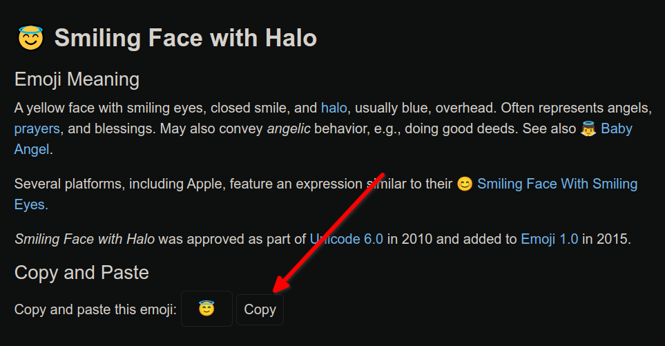
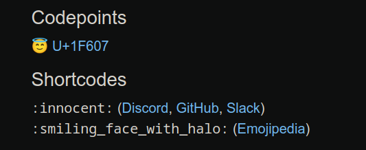

# 术语定义列表的创建

*注意：术语定义列表语法被 Markdown 官网列为扩展语法，**实测 Github 并不支持该语法**。使用时应当先查看自己所用的语法解释器 (parser) 的说明书。*

在 Markdown 中建立一个术语定义列表分两步。首先给出示例：

```
take
: 携带，拿走
: 带去，引领
: 把……带到（另一个层次、层面等）
: ……
```

你的 Markdown parser 的渲染结果：

take
: 携带，拿走
: 带去，引领
: 把……带到（另一个层次、层面等）
: ……

> 示例数据来源：[网易有道词典 2023-7-14](https://www.youdao.com/result?word=take&lang=en)

我这边的渲染结果：


可以看到，术语定义列表分为两个部分：

- 术语部分
- 定义部分

其中，**术语部分**放置在术语定义列表代码的第一行，并顶格书写；而**定义部分**则由形如 `: definition` 的多条定义语句构成，每条定义语句顶格单独占一行。注意，在 `:` 和 `definition` 存在一个**必要的空格**，不要忽略！

# 任务清单列表（TODO List）

*注意：任务清单列表语法被 Markdown 官网列为扩展语法，使用时应当先查看自己所用的语法解释器 (parser) 的说明书。*

Markdown 的任务清单语法十分简洁易读，我们可以使用该语法，或者使用 [表格语法](./ex5.md) 来制作简单的 **TODO list**。我在 [这个例子](./Examples/to-do_list.md) 中给出了一个使用表格语法制作的 TODO list 样例，并且给出了我自用的整洁 Markdown 表格的 [脚本](./Scripts/tidy_your_mkdown_table.py)，可以参考。

首先给出示例代码：

```
- [x] Recite 100 English words.
- [ ] Read 1 paper intensively.
- [x] Learn to write Markdown code.
- [ ] Review linear algebra.
```

- [x] Recite 100 English words.
- [ ] Read 1 paper intensively.
- [x] Learn to write Markdown code.
- [ ] Review linear algebra.

是不是很好看？（笑

即使如此，还是有几个点需要注意，才能写出正确的任务清单列表：

- **完成项**（需要打勾的项）使用 `[x]`，而**未完成项**（不需要打勾的项）使用 `[ ]`
- 未完成项的 `[ ]`，其中间的空格**不能**省略
- 每一行（清单项）开头处 `-` 后面的空格**不可以**省略
- `[ ]` 或者 `[x]` 后面的空格**不可以**省略

此外，任务清单列表在 Github 中相当常见，它被广泛地应用于 issues 等地方，并且具有一些特殊的语法以支持附加的功能。这部分可以参照 [Github Docs - Task Lists](https://docs.github.com/en/get-started/writing-on-github/getting-started-with-writing-and-formatting-on-github/basic-writing-and-formatting-syntax#task-lists) 、[Github Docs - About Task Lists](https://docs.github.com/en/get-started/writing-on-github/working-with-advanced-formatting/about-task-lists) 官方文档进行学习。其实总结下来就是：

> If you reference an issue, pull request, or discussion in a task list, the reference will unfurl to show the title and state.

# 在 Markdown 中使用 Emoji 表情

在文档中，适当地加入一些 Emoji 表情，能够使得文档更有表现力。

你可以从 QQ 或者其他地方复制 Emoji 表情并将其粘贴到 Markdown 编辑器中，这在我的 VSCode 中是可行的：

😂😏😘

如果你想要更全的 Emoji 表情列表，可以参考 [这个网站](https://emojipedia.org/) 。这里给出一个示例。



如上图，当你在上面给出的网站选好自己想要的表情后，就可以点击红色箭头所指示的 `Copy` 按钮来得到想要的 Emoji 表情。随后在 Markdown 编辑器中进行粘贴：

😇

当然，这一切都需要你的**渲染器支持你所使用的 Emoji 表情**。

根据 [Markdown 官方教程 - Markdown 使用 Emoji 表情](https://markdown.com.cn/extended-syntax/emoji.html) 给出的指引，我们还可以直接使用 Emoji 的 [对应代码](https://gist.github.com/rxaviers/7360908) 向 Markdown 中插入 Emoji 表情。

```
:sunglasses:
```
:sunglasses:

注意：这种代码并不是 Unicode 代码。这似乎是 GFM（ GitHub Flavored Markdown）的特性，旨在让读者身处 Markdown 渲染器不可用的环境时，仍然可以使得原始文本获得较好的可读性[^1]。我已经在我的环境配置下做了一些使用 Unicode 的尝试，但是均以失败告终。所以让我们还是使用复制粘贴的方式吧！

[^1]: https://stackoverflow.com/a/52726065/19336889

BTW，如果你确实想知道某个 Emoji 表情的 Unicode 编号，可以从上面给出的 Emojipedia 网站查询到，它位于网页的中下部，如下图。



上图中，`Codepoints` 指出了指定表情的 Unicode 编码，而 `Shortcodes` 则对应在 Markdown 中的编码。

```
:innocent:
```

:innocent:

