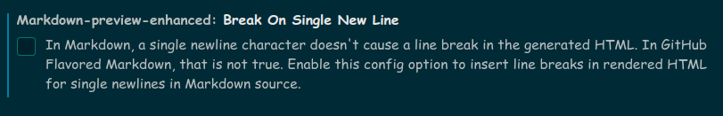
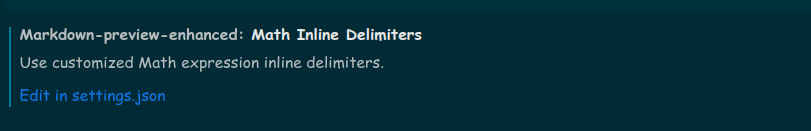
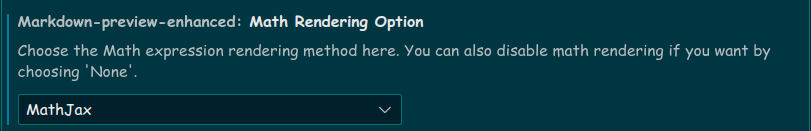
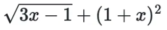
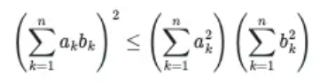
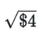

# 句段折叠语法

*注意：这部分的语法实际上使用了 HTML 的 Tag 风格的语法，在语法标准上与 Github 的标准（GFM）一致。*

在渲染结果中适时地将一部分文本（例如很长的文本）进行折叠，往往可以**起到使得文章繁简分明、重点突出的效果**；对于不需要阅读这部分内容的读者，就可以选择不展开这部分内容，从而**提高读者的阅读体验**。

想要在 Markdown 中将某一句段进行折叠，需要结合**使用 HTML 的 Tag 语法**。首先给出 [Github 官方文档](https://docs.github.com/en/get-started/writing-on-github/working-with-advanced-formatting/organizing-information-with-collapsed-sections#creating-a-collapsed-section) 上的**示例**：

``````

<details>

<summary>Tips for collapsed sections</summary>

### You can add a header

You can add text within a collapsed section. 

You can add an image or a code block, too.

```ruby
   puts "Hello World"
```

</details>

``````

上面的示例代码有如下**几个要点**：

- `<details>... </details>` 指示了句段折叠语法结构的全部范围
- 随后出现的 `<summary>... </summary>` 标明折叠后给出的概要内容，一般是较短的一句话。
- 剩余部分作为语法结构展开后呈现给读者的细节内容

正如示例代码中所描述的那样，你可以在该语法结构中自由地使用 Markdown 语法，例如标题、段落、代码块等。

示例代码的**演示效果**：

<details>

<summary>Tips for collapsed sections</summary>

### You can add a header

You can add text within a collapsed section. 

You can add an image or a code block, too.

```ruby
   puts "Hello World"
```

</details>

点击上面类似播放按钮的小三角试试看！你会发现它奇妙地展开了（笑

前段时间我正巧在 Github 上提了一个 [issue](https://github.com/Fndroid/clash_for_windows_pkg/issues/4669)，里面的日志文件 `logs` 部分有用到句段折叠语法，可以去围观一下。另外，在那个代码库中尝试提交 issue 时，会展示给你相关的代码，引导你这样去做，如下图。


这就是使用 Markdown 句段折叠语法的一个现实场景，其语法规则大同小异。

我曾经在 Github 上的某些仓库的 issues 中看到过**未折叠的、超级长的日志和代码块**，那东西翻起来真是超级让人厌烦！所以大家写东西（特别是要给别人看的那种）一定要规规矩矩的，善于换位思考，体察读者的需求。

# 在Markdown中书写数学公式

*本篇所介绍的语法属于 Markdown 的扩展语法部分，需要特定环境的支持*

## 前言

`LaTex` 中数学公式的风格很优美，是印刷排版的事实标准。因此 Markdown 的很多渲染器采用 `LaTex` 的语法作为自己的数学公式语法。

本文在写作时是以 Github 的 Markdown 标准进行书写的。因此，接下来将只针对 GFM 的数学公式书写方法进行简要的说明。

**请注意**：本篇并不会给出 `LaTex` 所有数学符号的范例，而是仅针对 Github 的教程做出必要的讲解，并给出我的环境配置指南。其实这部分并没有涉及到 `LaTex` 中较为复杂的一些问题，仅仅是借用了它的符号表而已，还是比较简单的。如果想要查看数学符号所对应的 `LaTex` 句式，请参阅 [这个 WikiBook 链接](https://en.wikibooks.org/wiki/LaTeX/Mathematics)，里面有各种数学公式符号的示例。你也应当通过搜索引擎，或者阅读额外的 `LaTex` 学习资料来进行学习。

## 配置说明

我依然使用 [说明](./description.md#我的环境配置) 中所描述的环境配置，但是在本地插件的配置上进行了一些调整，以使得本地渲染环境的标准与 Github 的标准相一致。

在 `Markdown Preview Enhanced` 插件设置中，我修改了如下的几个选项：

- 取消勾选：`Break On Single New Line`。这一点其实和数学公式编辑没关系，是我之前早就修改过的配置，实际上就是让段落构成的规则变成空行，而不是直接的回车。
   
- 编辑设置：`Math Inline Delimiters`
   
   在 `settings.json` 中编辑：
   ``` json
   "markdown-preview-enhanced.mathInlineDelimiters": [

        // [
        //     "$",
        //     "$"
        // ],
        [
            "\\(",
            "\\)"
        ],
        [
            "$`",
            "`$"
        ]

    ],
   ```
   这一步主要是影响你的嵌入式公式的定界符，如此一来便与 [Github 所推荐的做法](https://docs.github.com/en/get-started/writing-on-github/working-with-advanced-formatting/writing-mathematical-expressions#writing-inline-expressions) 相一致了。
   > ... The latter syntax is useful when the expression you are writing contains characters that overlap with markdown syntax. 

- 设置 `Math Rendering Option` 选项为 `MathJax`：
   
   这样便将 VSCode 本地的渲染器调整为与 [Github 标准](https://docs.github.com/en/get-started/writing-on-github/working-with-advanced-formatting/writing-mathematical-expressions#about-writing-mathematical-expressions) 相一致的状态。
   > GitHub's math rendering capability uses MathJax; an open source, JavaScript-based display engine.

## 简单的演示

这里主要是借用 [Github 文档](https://docs.github.com/en/get-started/writing-on-github/working-with-advanced-formatting/writing-mathematical-expressions) 中给出的例子进行演示和学习，我也会将在使用 Markdown 书写数学公式时遇到的好例子更新到这里。

### Inline 型公式的示例

数学公式：



Markdown 代码：

```
This sentence uses `` $` `` and `` `$ `` delimiters to show math inline:  $`\sqrt{3x-1}+(1+x)^2`$
```

渲染效果：

This sentence uses `` $` `` and `` `$ `` delimiters to show math inline:  $`\sqrt{3x-1}+(1+x)^2`$

### 单独展示的公式示例

数学公式：



Markdown 代码：

```
**The Cauchy-Schwarz Inequality**
$$\left( \sum_{k=1}^n a_k b_k \right)^2 \leq \left( \sum_{k=1}^n a_k^2 \right) \left( \sum_{k=1}^n b_k^2 \right)$$
```

渲染效果：

**The Cauchy-Schwarz Inequality**
$$\left( \sum_{k=1}^n a_k b_k \right)^2 \leq \left( \sum_{k=1}^n a_k^2 \right) \left( \sum_{k=1}^n b_k^2 \right)$$

## 需要使用 $ 符号怎么办？

Github 文档给出的答案：

> To display a dollar sign as a character in the same line as a mathematical expression, you need to **escape** the non-delimiter $ to ensure the line renders correctly.

即我们需要将 `$` 字符进行转义。而从使用 `$` 字符的场景来看，无非分为两种情况：

1. 在数学公式内使用 `$` 字符。此时，你需要在该 `$` 字符前面添加一个转义反斜杠 `\`。

   数学公式：

   

   Markdown 代码：

   ```
   This expression uses `\$` to display a dollar sign: $`\sqrt{\$4}`$
   ```

   渲染效果：

   This expression uses `\$` to display a dollar sign: $`\sqrt{\$4}`$

2. 在数学公式之外的同一行使用 `$` 字符。此时，你需要使用 HTML 的语法来实现。

   数学公式：

   

   Markdown 代码：

   ```
   To split <span>$</span>100 in half, we calculate $100/2$
   ```

   渲染效果：

   To split <span>$</span>100 in half, we calculate $100/2$

