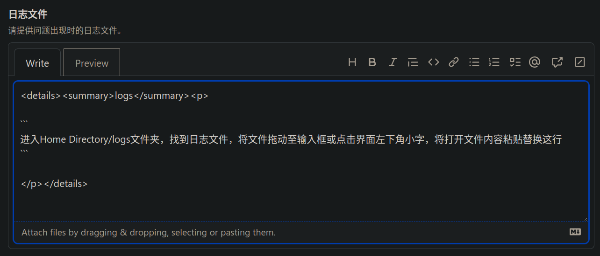

# 句段折叠语法

*注意：这部分的语法实际上使用了 HTML 的 Tag 风格的语法，在语法标准上与 Github 的标准（GFM）一致。*

在渲染结果中适时地将一部分文本（例如很长的文本）进行折叠，往往可以**起到使得文章繁简分明、重点突出的效果**；对于不需要阅读这部分内容的读者，就可以选择不展开这部分内容，从而**提高读者的阅读体验**。

想要在 Markdown 中将某一句段进行折叠，需要结合**使用 HTML 的 Tag 语法**。首先给出 [Github 官方文档](https://docs.github.com/en/get-started/writing-on-github/working-with-advanced-formatting/organizing-information-with-collapsed-sections#creating-a-collapsed-section) 上的**示例**：

``````

<details>

<summary>Tips for collapsed sections</summary>

### You can add a header

You can add text within a collapsed section. 

You can add an image or a code block, too.

```ruby
   puts "Hello World"
```

</details>

``````

上面的示例代码有如下**几个要点**：

- `<details>... </details>` 指示了句段折叠语法结构的全部范围
- 随后出现的 `<summary>... </summary>` 标明折叠后给出的概要内容，一般是较短的一句话。
- 剩余部分作为语法结构展开后呈现给读者的细节内容

正如示例代码中所描述的那样，你可以在该语法结构中自由地使用 Markdown 语法，例如标题、段落、代码块等。

示例代码的**演示效果**：

<details>

<summary>Tips for collapsed sections</summary>

### You can add a header

You can add text within a collapsed section. 

You can add an image or a code block, too.

```ruby
   puts "Hello World"
```

</details>

点击上面类似播放按钮的小三角试试看！你会发现它奇妙地展开了（笑

前段时间我正巧在 Github 上提了一个 [issue](https://github.com/Fndroid/clash_for_windows_pkg/issues/4669)，里面的日志文件 `logs` 部分有用到句段折叠语法，可以去围观一下。另外，在那个代码库中尝试提交 issue 时，会展示给你相关的代码，引导你这样去做，如下图。



这就是使用 Markdown 句段折叠语法的一个现实场景，其语法规则大同小异。

我曾经在 Github 上的某些仓库的 issues 中看到过**未折叠的、超级长的日志和代码块**，那东西翻起来真是超级让人厌烦！所以大家写东西（特别是要给别人看的那种）一定要规规矩矩的，善于换位思考，体察读者的需求。

