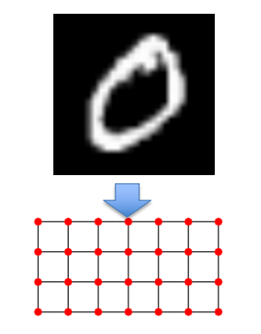
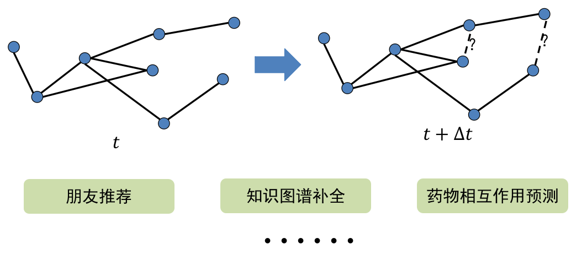
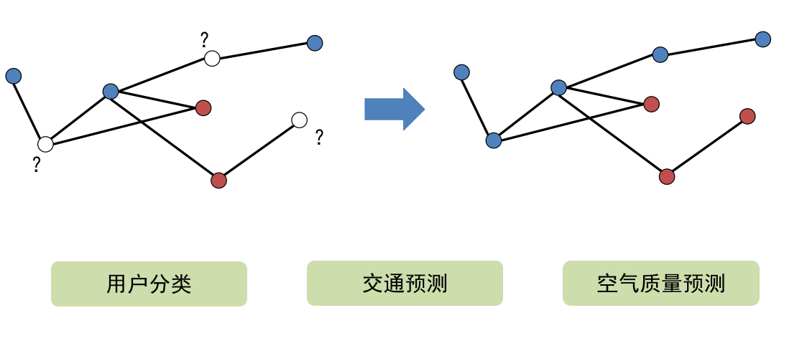
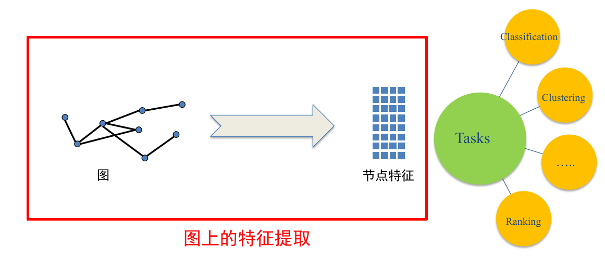
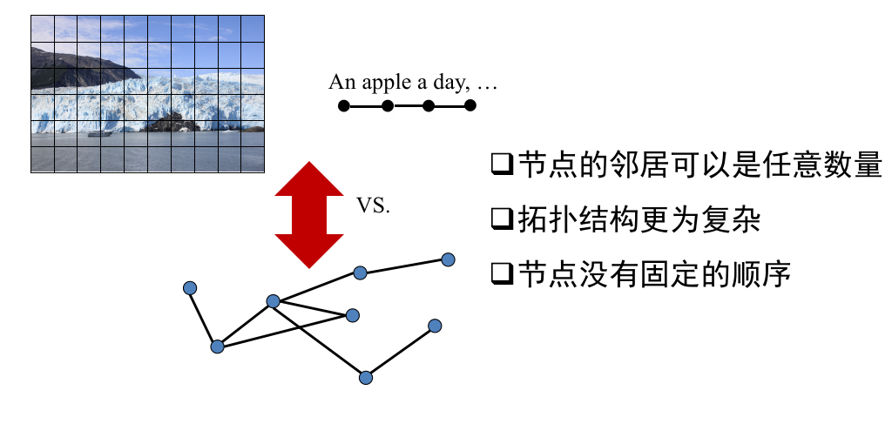

# 为什么要关注图深度学习？

2023/7/5 - april211

## 前言

本人是图深度学习的小白。在此之前有做过一些深度学习视觉相关的项目，学习过机器学习基础课程，计算机专业基础课勉强凑合。但是对图深度学习，甚至图论都没有相关的基础。撰写本随笔的原因，在于记录自己入门学习的过程，供日后复习之用。

本随笔中使用的部分图片来源于《图深度学习》PPT，版权归原出版方所有，仅供交流学习使用。如有侵权，请联系我，我会立即进行删除。

## 经过

前几天翻研究生组里的学习文件，翻到了《图深度学习》一书的一份入门 PPT ，里面提出了一个我觉得很重要的问题：

> 我们为什么要关注图深度学习？

这个问题提到了两个名词，一个是 `图`，一个是 `深度学习`。

`图` 是一种数据结构，它是一种“通用的数据表示形式”，意味着生活当中产生的许多数据都可以通过某种特定的解读方式，转换成图数据结构。这说明图深度学习能够处理的数据类目应当是极其广泛的，具有大一统的性质和倾向。

上图是原 PPT 中将常见的图像数据转换成图数据的示意图，注意这两个名词的差别，含义是完全不同的。

图数据结构，其拓扑结构由节点和边组成。在将原始数据转化成图数据后，可以形成一张由节点和边组成的“**网**”。而深度学习的最终目的在于实现某种“预测”，所以可以预想到图深度学习要预测的，是这张“网”上的节点或者边。

如上图，我们可以使用深度学习技术，对图上节点之间的关系（即图数据结构中的边）进行预测。这种预测可以具体化到诸如：**朋友推荐、知识图谱补全、药物相互作用**等问题的预测。

除此之外，我们还可以利用图信息，对图数据结构上的节点进行预测，如下图。

上图中，通过利用待预测对象相邻区域的图结构信息，可以实现针对对象类别的预测。这种预测可以应用到诸如：**用户分类、交通预测、空气质量预测**等问题的解决过程中。

这里一个问题就产生了：

> 解决这些问题，非要用图深度学习不可吗？

这本质上是在问：图深度学习有什么用？为什么要使用它而不是其他技术？

这就给图深度学习的研究者提出了一个很重要的要求：图深度学习的研究目标，必须是为了提高问题解决的效能，而不是使得问题的解决方案**无谓地**复杂化。图深度学习必须要研究的是，如何利用自身的结构性质，来提出针对问题的更好的解决方案。简单来说，就是归结于原 PPT 里的一句话：

> 如何利用图的信息提升这些任务的效果？

这是研究者在图深度学习的研究过程中必须要思考的问题。我们的研究成果，应当让付出的每一份代价**有所值**。

---

研究者需要找到使用深度学习技术来抽取图数据结构中有价值信息的方法，从而构建图的特征以用于问题的预测任务（例如分类、聚类、推荐等），如下图。

这一点要做到并不简单，因为图数据与图像数据等数据类型不同，它是高度不规则、非结构化的数据，虽然该特点赋予了图数据结构泛化性强、适用性广的特点，但是也导致了其拓扑结构较其他数据复杂、特征信息提取更为困难的现实问题。

图深度学习除了上文中提到的诸多用途以外，还可以应用于推荐系统、交通预测、药物发现等领域。

